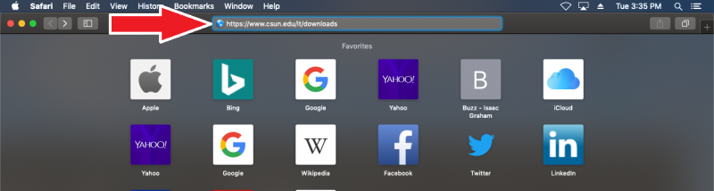
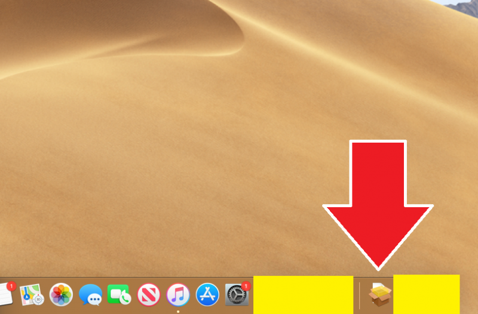

## Introduction
---------------
All CSUN students, faculty, and staff can use the Virtual Private Network (VPN) to access intranet-only resources from anywhere in the world. Additionally, the VPN can be used in conjunction with Remote Desktop to connect to your office computer remotely. Remote access must be granted via a request to AS-IT. If you have been given permission for remote access, follow the steps below to install the VPN client and the Remote Desktop application on your home computer. You will need administrator privileges on your home computer, as well as the name of your office computer, which AS-IT can provide.

## Installing the VPN Client on MacOS
-----------------
1. First, you need to launch Safari.

	

2. On your search bar, enter: https://www.csun.edu/it/downloads

	

3. Enter your CSUN username and Password.

	

4. Make sure you Download "GlobalProtect Virtual Private Network (VPN) Client".

	

5. The file should be downloading. You can access it by clicking on the downloads folder.

	

6. Select the "Global Protect" file.

	

7. Click "Continue" on the Global Protect Installer.

	

8. Make sure that "GlobalProtect" is checked off and click "Continue".

	

9. Make sure that you're installing "GlobalProtect" on "Macintosh HD". If it is not selected, press "Change install Location" and click on "Macintosh HD" and continue. Click "Install" after you have selected "Macintosh HD".

	

	

10. Enter your password to continue.

	

11. Global Protect should open and you will need to type "vpn.csun.edu" and hit connect. It might ask you to enter your CSUN credentials.

	

12. Smething

	
