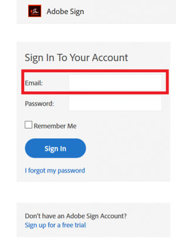
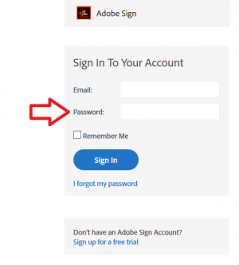
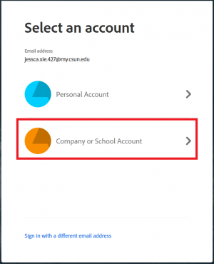
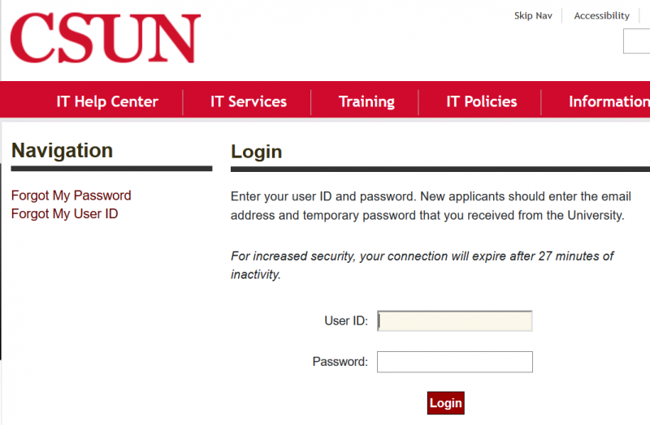
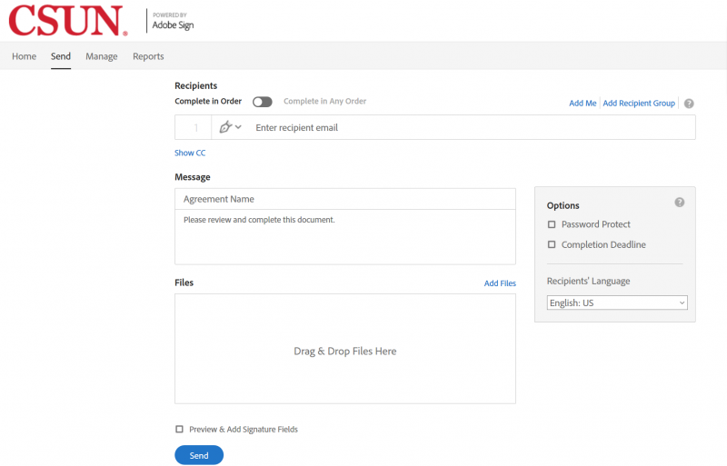
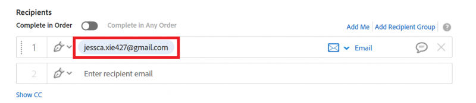
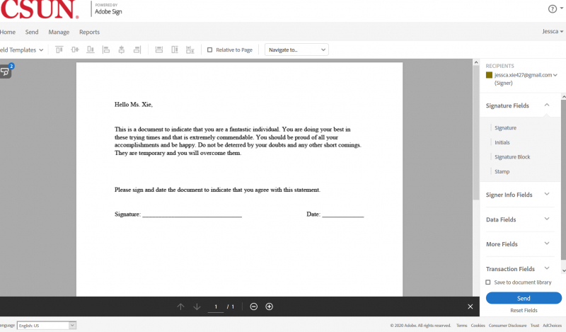
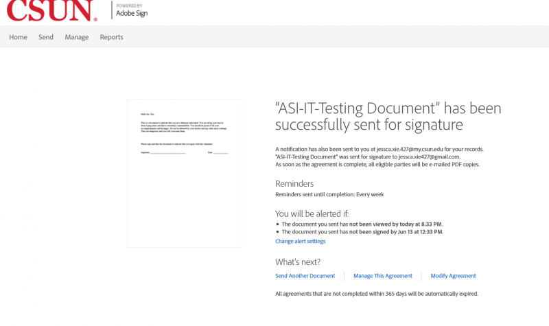

## Introduction
The purpose of this article is to teach users how to use Adobe Sign.

### How to Login to Adobe Sign

1. Go to https://acrobat.adobe.com/us/en/sign.html and click on “Sign In”

   

2. Input your CSUN email address

   
 
3. After you input your CSUN email address, click on the password field

   

4. You will be taken to another screen that will ask you to select an account. Select “Company or School Account”

   

5. You will be taken to the CSUN login page. Input your CSUN Credentials to login to Adobe Sign

   
   
6. You are now logged in to Adobe Sign.

   
   
### How to Create and Send a Document

1. Click "Send" at the top of the page or click on "Request Signatures"
   
   
   
   

2. You will be taken to this page to begin creating your document

   

3. Input the recipient you want to send the document to. NOTE: You can’t send a document to yourself to sign

   

4. Name the document. The document should be “ASI-[Department Name]-[Name of document]”

   

5. Add the file that needs to be signed. Make sure “Preview and Add Signature Fields” is checked off. This will allow you to add signature fields in the next section

   

6. Once the document is processed, you will be redirected to this page to preview and add Signature Fields

   

7. To add a signature field, click “Signature” and drag it into the document

   

8. The document should look like this with the Signature Field

   

9. Click on the Signature Field to double check that the field is assigned to the correct individual

   

10. Click “Send” to send the document. NOTE: Once the document is sent, it can’t be changed

   

11. You will be redirected to this page to indicate that the document has been successfully created and sent

   

