## Introduction
_________________________________________________________________________________________________
The Matador Information Network Display screens (herein referred to as “MIND”) are a network of 18 digital signage screens that are installed in various locations throughout the CSUN campus. These signage screens provide the CSUN community with information regarding campus events, resources, and promotions.

There are a total of 28 digital signage screens spread across the campus. Associated Students I.T. (818-677-8888) manages all 28 screens with regards to the maintenance and repair of the hardware and software. Associated Students Marketing manages the content that is shown on the 18 MIND screens. The remaining 10 screens are owned by various departments on campus, who also manage their own content. Those departments share use of the MIND server to manage their digital signage screens.

This guide goes over the process to log into the MIND server (known as “Airbean”) and some of the functions of Content Manager. It also includes the steps to add, schedule, remove, delete, and otherwise update the content on the various templates that powers the MIND screens.

## Network Diagram
_________________________________________________________________________________________________
This Microsoft Paint diagram visualizes the relationship between your office PC, the MIND share, the Airbean server, and the player screens. Content Manager is a client-server application that is hosted on Airbean and access via remote connection from your office PC. Airbean (and Content Manager by association) cannot see any files on your office PC, which is why content must be uploaded from your office PC to the MIND share.

  

### Connecting to Airbean
_________________________________________________________________________________________________
Connecting to Airbean is the same process, regardless of which department you are from. It differs only in the operating system that you are using.

### Connecting from MacOS

1. Launch the Microsoft Remote Desktop app from Launchpad or the dock. (If you do not have the Microsoft Remote Desktop app, it's a free download from the Mac App Store).

  

1. Click on the "New" button.

  

1. In the “Edit Remote Desktops window, enter “Airbean” for “connection name” and “airbean.csun.edu” for “PC name”. Leave the rest blank and/or as default. Once your done, click the red "close dot" in the upper left of the window.

  

1. You should now see Airbean listed under “My Desktops”. Double-click on Airbean.

  

5. Click “continue” when the security warning appears.

  

6. Enter your "short" CSUN username and regular password when prompted, then click “OK”

  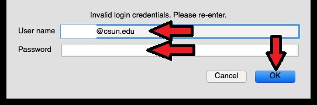

7. You should now be on Airbean's desktop, as shown below.

  

The rest of the steps are the same, regardless of the OS you're using. Proceed to Opening Content Manager

### Connecting from Windows 10

1. Click the "Start" button and start typing "Remote Desktop Connection". Click on Remote Desktop Connection.

  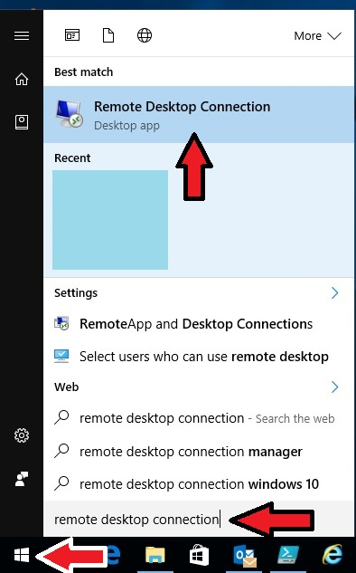

2. In the "Remote Desktop Connection" window, enter "airbean" for the computer and click "Connect".

  

3. Enter your "short" CSUN username and regular password when prompted, then click “OK”.

  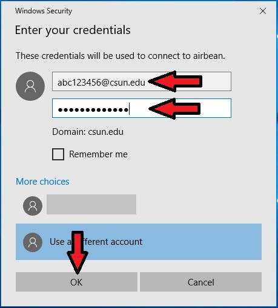
 
The rest of the steps are the same, regardless of the OS you're using. Proceed to Opening Content Manager

**Opening Content Manager**
1. From Airbean's desktop, click the "Start" button, then click "All Programs", "Four Winds Interactive", and finally "Content Manager".

  

2. If this is your first time logging into Content Manager, you will be prompted to open a database. Expand “Signage on Airbean/SQLExpress” and select the "Cal State Northridge" database, then click "Open".

  

3. You should now be on the landing page of Content Manager.

  

### Mapping the MIND Share
_________________________________________________________________________________________________
The MIND shared drive is where all deployed content should be copied to. The MIND share is continuously available to Content Manager, whereas your local computer is not.

To copy content from your local computer to the MIND share, you will need to map the shared drive. The steps differ based on your local computer's operating system.

**MacOS**

The MIND share will need to be manually reconnected every time the computer is restarted or you log out and log back in. However, the server name can be saved to avoid having to re-type it each time.
1. Open Finder, then in the menu bar, click on "Go" then click on "Connect to Server"

  

2. Enter the server address exactly as show. Click the "+" button to save the path. Then click "Connect".

  

3. Click the "registered user" radio button. Enter your short CSUN username and regular password. Then click "Connect".

  

4. Open Finder then click "File" then "New Finder Window".

  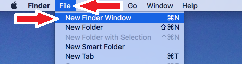

5. Under "shared", click on "Bakedbean" then "Mind" then your respective department's folder. Copy any content items from your local computer to your department's folder on the Mind share.

  

**Windows**

The MIND share will only need to be mapped once per user, per computer. After it is mapped once, Windows will remember it and reconnect to it whenever the computer is restarted.

1. Open the File Explorer by clicking on the "Folder" icon on the task bar.

  

2. Click on "This PC" on the left pane, then click the "Computer" tab at the top, then click "Map Network Drive" and "Map Network Drive".

  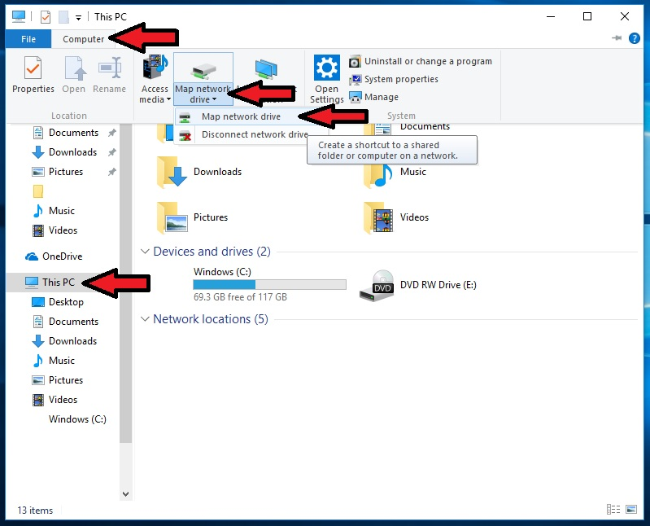

3. In the "Map Network Drive" window that opens, select Y: from the drop-down menu (if Y: is already being used, select a different drive letter). Enter the "Folder" path exactly as shown. Make sure that the box next to "Reconnect at sign-in" is checked. Then click "Finish".

  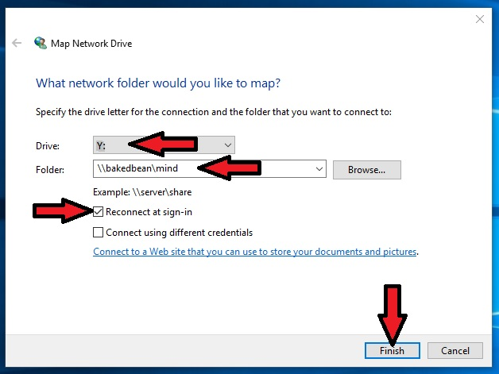

4. The MIND share should open. If it does not, then click back to "This PC", and double-click the "MIND" share.

  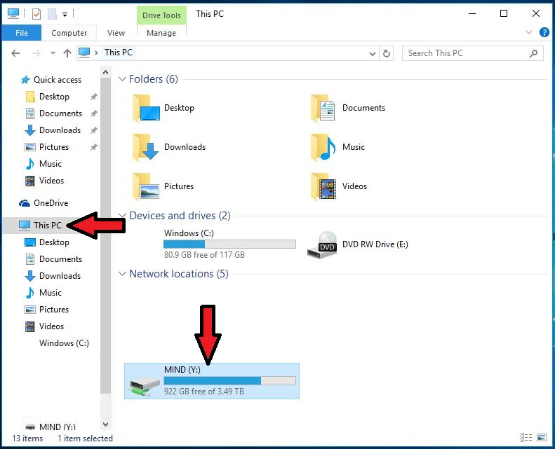

5. After opening the MIND share, double-click on your department's folder. Copy any content items from your local computer to your department's folder on the Mind share.

  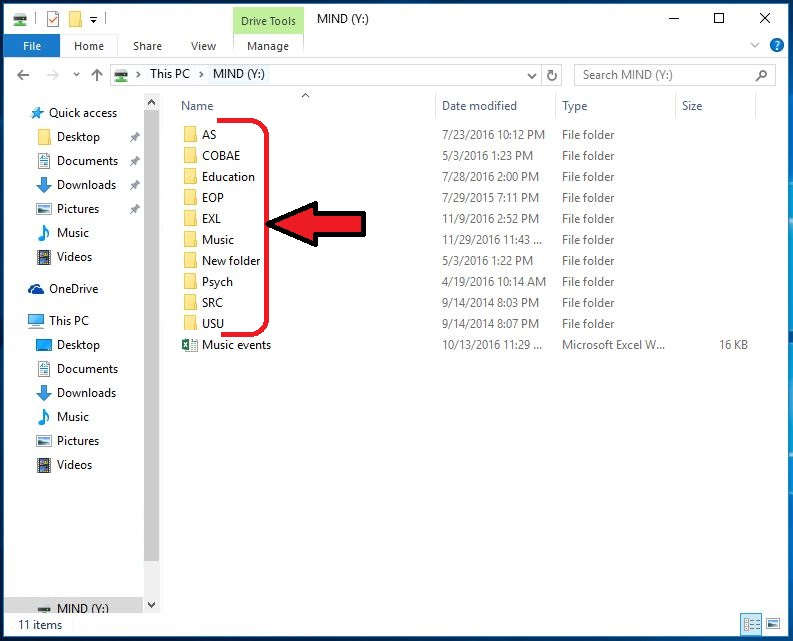

### Overview of the Content Manager Home Screen
_________________________________________________________________________________________________
After you log into Content Manager, you will see a screen similar to that shown below (this will vary depending on your specific department). Below the screen shot is a breakdown of each item that is pointed out in the screen shot.

  

**Content Buttons**

These are used to add new content items to Content Manager.

**Content Library**

This is where content items that were added to Content Manager are stored and organized. This includes all items, including content items that are currently scheduled, as well as those that are not.

**Network Overview**

The Network Overview displays the breakdown of the entire network of player screens. The network is organized in a hierarchical format. It breaks down as:
"World" (Cal State Northridge) > Department (red buildings) > Player (blue rectangle) > Template (green rectangle) > Region (yellow square) > content item (various).
Starting from the bottom, a single content item is scheduled to a region. That region is part of a template. That template is scheduled to play on a player. That player is part of a department. That department is part of Cal State Northridge.

**Schedule**

The schedule visually summarizes when a specific template or content item is set to play. A single cell within the schedule represents one full 24-hour day. The vertical, dotted red line indicates the current time.

### Managing Content (General Process)
_________________________________________________________________________________________________
Managing content in Content Manager can be summarized as the following two types:
  - Media items (posters and videos)
  - Event calendar items
Specific departments may have additional content items, but generally speaking, those additional items are largely automated and require no maintenance on the part of the department. Such items include:
  - RSS news feeds
  - Weather apps
  - Date and time
  - Static text headers

**Adding a Media Item**

This guide uses an example OU for demonstration purposes, but the process is nearly identical for other departments except AS Marketing.
1. On your office/local computer, open your department's folder (as described in the section Mapping the MIND Share). Then copy your content item from your office computer to the MIND share.

  

2. Connect to Airbean as described in the section Connecting to Airbean and open the Content Manager as described in the section Opening Content Manager.

3. Now we need to upload our new content item from the MIND share to the Content Manager application itself. On the left pane of Content Manager, click the corresponding content button for your file type (in this case, we are using a PDF as an example).

  

4. In the properties window that opens, give your new content item a name. Note that this does not have to be the same as the file name of the content item. This is simply a name that you can identify it by while in Content Manager. Then click the folder button next to the "URL" field.

  

5. In the Dynamic URL window that opens, click on Insert from File System on the left.

  

6. Click on the "..." button.

  

7. Locate and select your file on the MIND share. Then click "Open"

  

8. Click "Insert"

  

9. Note how the URL file path is now filled in. Click "OK"

  
 
10. Your new content item will now appear in the Content Library's root directory. Click and drag your content item to your respective department's Content Library folder. Follow the path of the red arrow to avoid selecting other items. Please note that AS-IT reserves the right to move or delete any content items that are left in the root directory.

  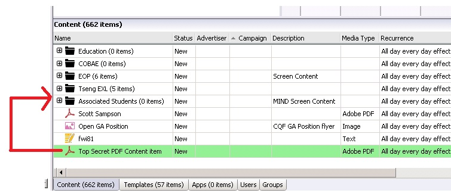

11. Go up to the Network Overview. Expand your department's OU and the player(s), template(s), and region(s) to which you want to add your new content item to. Note that content items must be added to a region (yellow box) of a template (green icon) that is set under a player (blue icon).
For this example, we will be adding our new content item to the main area region of the horizontal 12 template that is scheduled to the AS-MIND-TIC-01 Countdown Test player screen.

  

12. Click and drag your content item from the Content Library to the region of the template. Follow the red arrow to avoid selecting other items

  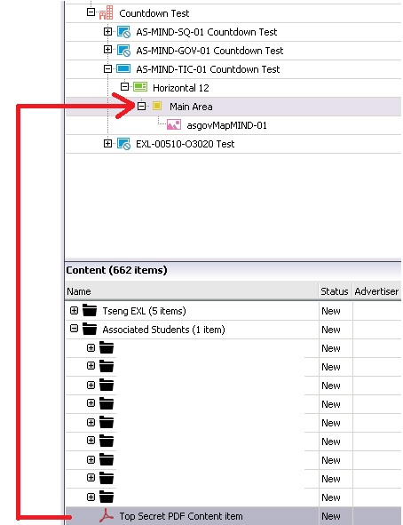

13. The posters will play in a top-down order on the screen. To change the order, simply drag the posters into the order that you want them to appear on-screen.

  

14. We will now need to deploy. See the section Deploying Content.

**Removing a Media Item from the Schedule**

1. Connect to Airbean as described in the section Connecting to Airbean and open the Content Manager as described in the section Opening Content Manager.

2. In Content Manager, expand the Network Overview and right-click the content item that you wish to remove. Click "Remove".

  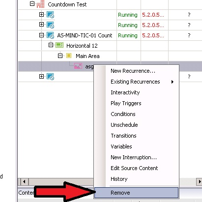

3. We will now need to deploy. See the section Deploying Content.

**Adding an Event to the Events Calendar**

The information for each department's Events Calendar is stored on a CSV file located on the MIND share. Each department with an Events Calendar has their own CSV file. Content Manager then interprets the information and formats it automatically with the desired font and layout.
1. Connect to Airbean as described in the section Connecting to Airbean. Open the Content Manager as described in the section Opening Content Manager.
2. Locate and open your department's CSV file on the MIND share.
3. Add the row with the event's information. Save and close the CSV.
4. We will now need to deploy. See the section Deploying Content.

**Removing an Event from the Events Calendar**

The information for each department's Events Calendar is stored on a CSV file located on the MIND share. Each department with an Events Calendar has their own CSV file. Content Manager then interprets the information and formats it automatically with the desired font and layout.
1. Connect to Airbean as described in the section Connecting to Airbean. Open the Content Manager as described in the section Opening Content Manager.
2. Locate and open your department's CSV file on the MIND share.
3. Delete the row with the event's information. Save and close the CSV.
4. We will now need to deploy. See the section Deploying Content.

**Deploying Content**

Any changes that are done in Content Manager and/or the Events CSV must be followed by deploying. Deploying pushes the changes (that we've done in Content Manager) across the CSUN network and copies them and any content items to the player screen's local hard drive. In the event of network failure, the player screen will continue to play the last deployment that it received, but it will not be able to receive new deployments until network access is reestablished.
1. In Content Manager, find your department's OU in the Network Overview. Right-click your department's OU and click "Deploy".

  

2. If the Save Changes window appears, click "Save Changes". If it does not appear then skip to step 3, as your changes were automatically saved (Content Manager periodically saves changes as you work).

  

3. The "Deploy" window will now open and you can see the content item(s) being copied to the player(s). Once "All deployments were successful" appears, click "Close".

  

4. The deployment is now complete. Close Content Manager and log off of Airbean.

### AS Marketing
(coming soon)

### COBAE
(coming soon)

### Education
(coming soon)

### EOP
(coming soon)

### EXL
(coming soon)

### Music
(coming soon)
