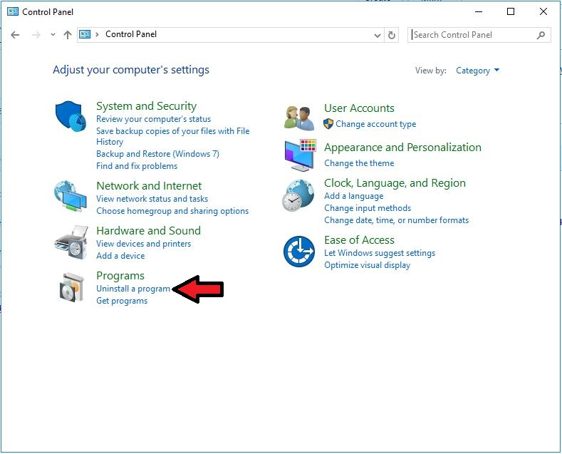
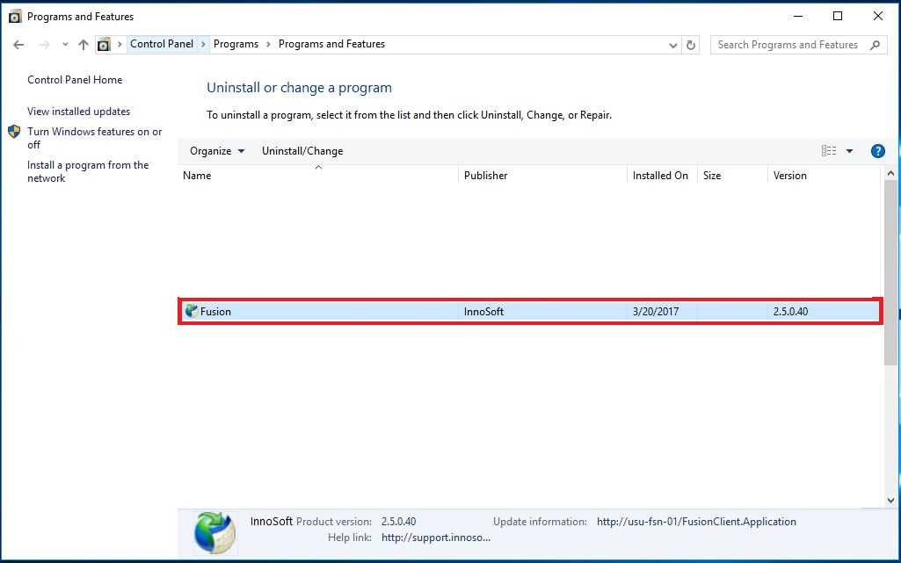
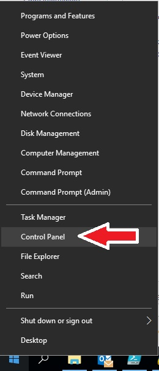
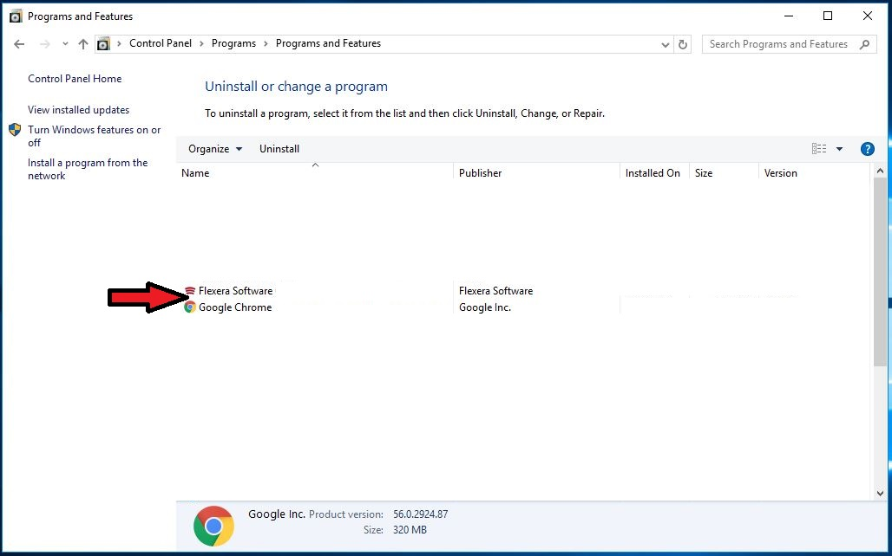
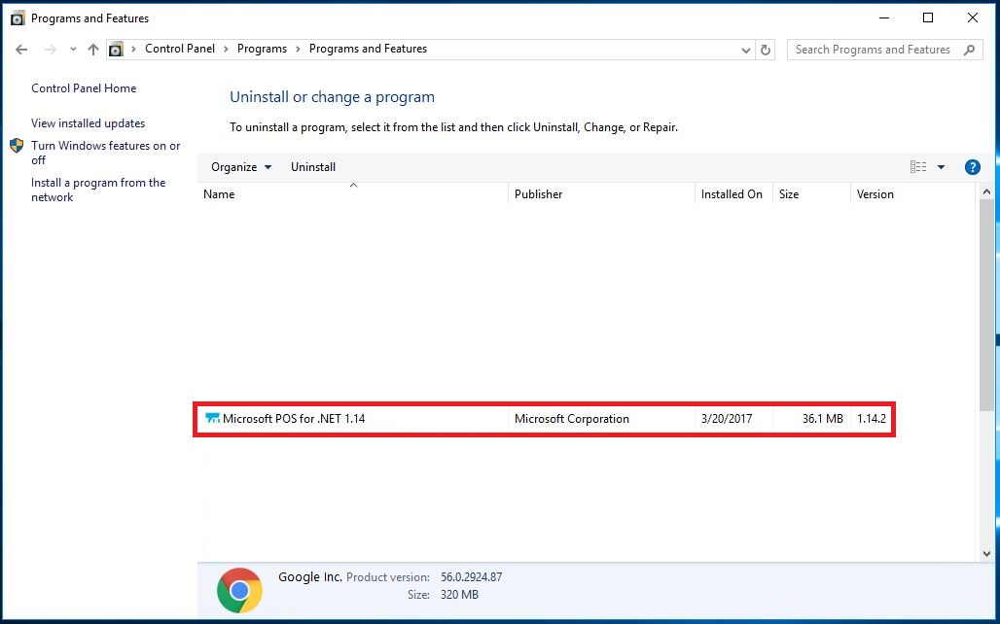
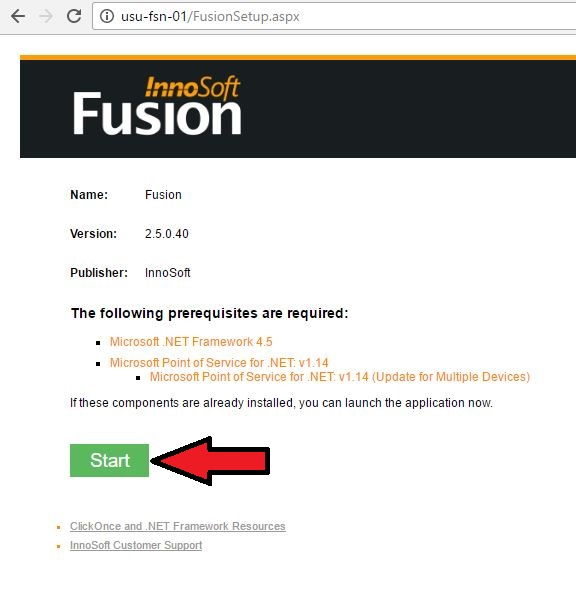
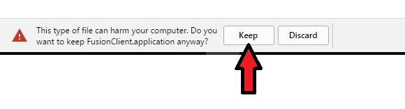
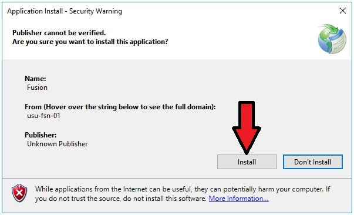
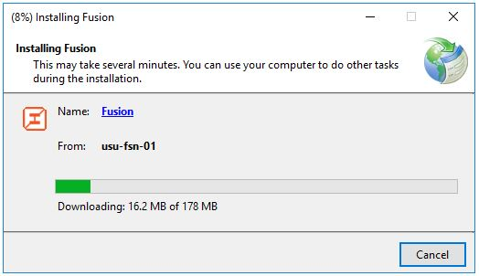

## Introduction
------------------
Fusion is a software application that is used by several entities on campus for activities related to student recreation.

The supported version as of 3/20/2017 is 2.5.0.40. Please be sure that you have this version, otherwise Fusion will not work.

## Check Your Version
---------------------
Follow the steps below to check your version of Fusion.
1. Open the Control Panel by right-clicking the Start button and clicking "Control Panel".

	

2. Click on "Uninstall a Program"

	

3. Look for your version number. The supported version as of 3/20/2017 is 2.5.0.40.

	

## Uninstalling Fusion
----------------------
1. Open the Control Panel by right-clicking the Start button and clicking "Control Panel".

	

2. Click on "Uninstall a Program"

	

3. Click on Fusion, then click "Uninstall/Change" at the top.

	

4. Click on the radio button next to "Remove the application from this computer", then click "OK"

	

5. The application will uninstall. It usually takes less than 30 seconds. Once the window closes, check the Control Panel and verify that Fusion is no longer listed.

	

## Installing Fusion
----------------------
1. Open the Control Panel by right-clicking the Start button and clicking "Control Panel".

	

2. Click on "Uninstall a Program"

	

3. Verify that you see "Microsoft POS for .NET 1.14". If you do NOT see it, or see a version that is NOT 1.14 (such as 1.11 or 1.12) then STOP and call x8888. If you do see "Microsoft POS for .NET 1.14" then proceed to step 4.

	

4. Open a web browser (Chrome is used in this example) and copy/paste the following into the address bar: http://usu-fsn-01
Then click on "Start"

	

5. Click "Keep"

	

6. Once the application has downloaded, click on it to open it.

	

7. Click "Install"

	

8. Wait while the application installs.

	

9. Fusion will open once it is installed. Sign in when Fusion opens. You should also have a "Fusion" icon appear on your desktop.

	

