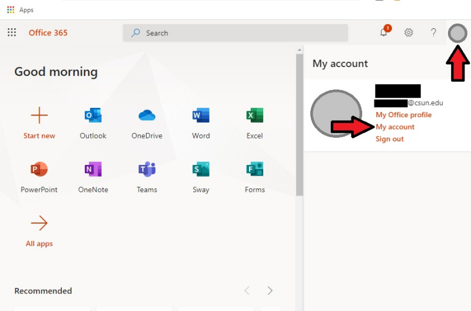

## Introduction
{: .no_toc }
The purpose of this article is to show highlighted features of Microsoft Office 365.

---

## Table of Contents
{: .no_toc .text-delta }

1. TOC
{:toc}

---

## Microsoft Office for Faculty & Staff Personal Devices
-----------------
From the CSUN IT Website
*All CSUN faculty and staff can now install the Microsoft Office Suite on up to five personal devices for free.
Before you install the software, you must remove any earlier versions of Office (2003, 2007, 2010).*

## Installing Microsoft Office on a Personal Device (Windows and MacOS)
------------------
1. Uninstall any previous versions of Microsoft Office.

2. Navigate to https://www.csun.edu/webmail and click on "Office 365".

3. Log in with your CSUN credentials.

4. You will now be on the "landing page" of Office 365. Click on your profile picture/initials in the upper-right corner, then click on "My Account".

	

5. Click on "Office apps" on the left.

	

6. You will be redirected automatically to the tab called "Apps & devices". Click on the "Install Office" button on the right.

	

7. Follow the prompts to download and install Office.

*Please note*, if you do not see the "Install Office" button, please take a screenshot and submit an IT request at https://www.csun.edu/as/administration. You likely were not assigned a personal-use license from CSUN IT.

More information regarding Microsoft Office for faculty & staff can be found on the CSUN IT web site: https://csun.edu/it/download-office
- CY 9/4/2020