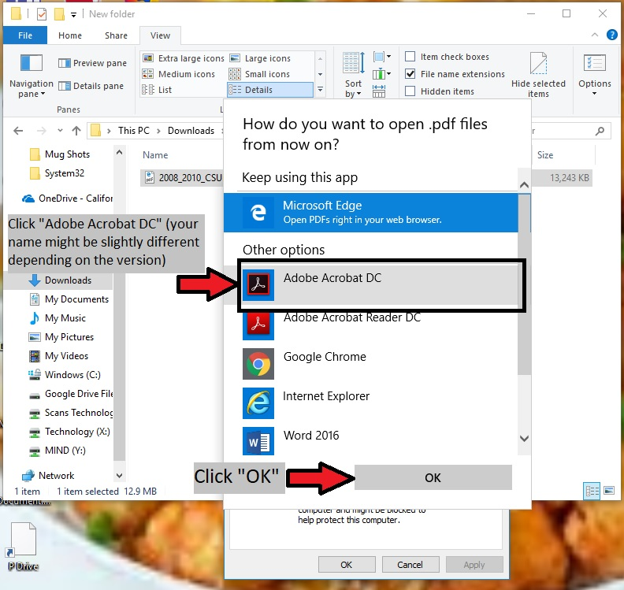
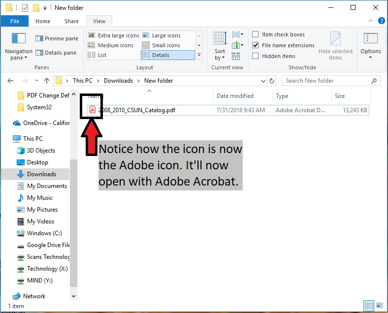

## Introduction
---------------
The purpose of this wiki is to guide you through common requests that we've received to change features on Windows 10.

## Default PDF Viewer
-----------------
The default PDF viewer in Windows 10 is Microsoft Edge.

**Check and Change Your Default PDF Viewer**
1. Find a PDF document, right-click it, and click on "Properties".

	

2. Click on the "Change..." button.

	

3. Click on "Adobe Acrobat DC" (or whichever application that you want to use to open PDFs) then click "OK"

	

4. Click "OK" to close the properties dialog box.

	

5. The icon has now changed to that of your new default PDF viewer (Adobe Acrobat in this case). Double-click the document to open it.

	