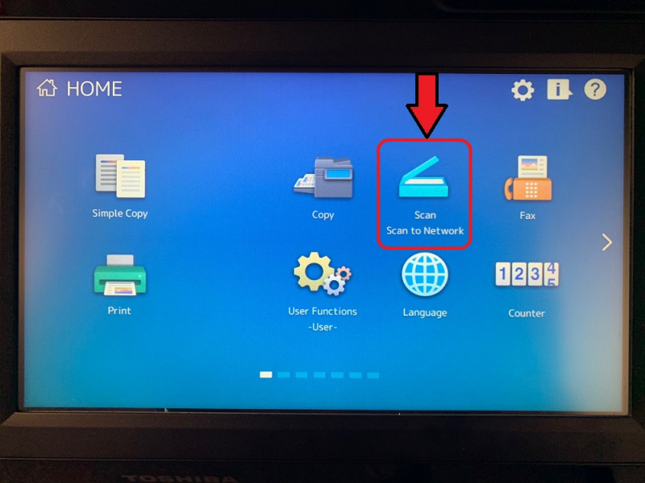
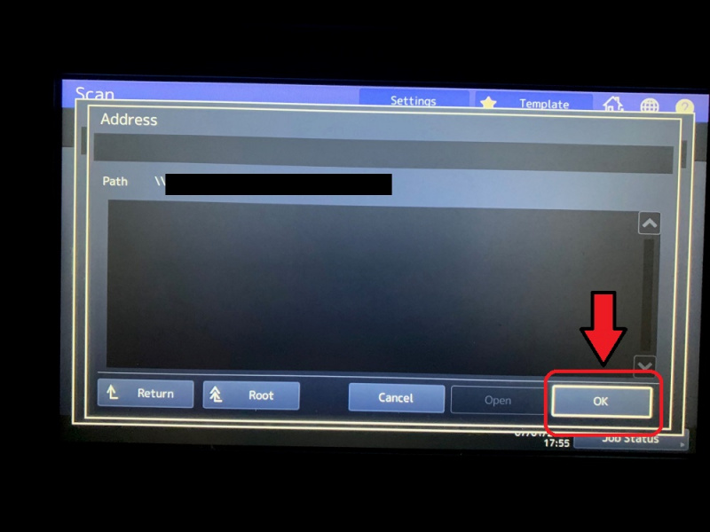
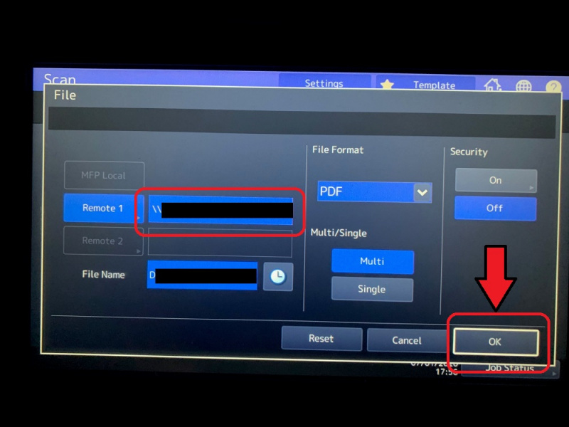

## Introduction
---------------
This Wiki includes some tips that we found to be helpful with using the printers.

## Scanning Documents on the 6515 MFP
-----------------
These instructions were created using the Automatic Document Feeder (ADF) as an example. Using the flatbed is a similar process, except put your documents on the glass in Step 1.

1. Load your documents into the ADF on the top of the printer. Please note that the ADF pulls pages from the top of the stack down, so the first page of your document should be on top of the stack, and the last page on the bottom of the stack. The blue light will illuminate to indicate that documents are in the ADF, and the ADF will rise upward.

	

2. On the MFP Control Panel, tap "Scan to Network".

	

3. In the "Scan" menu, tap "File"

	

4. In the "File" menu, tap "Remote 1"

	

5. In the "Remote Setting" menu, tap your department folder, then tap "OK".

	

6. In the "Address" menu, verify that your department name appears to the right of "Path", then tap "OK"

	

7. You should now be back on the "File" menu. Tap "OK".

	

8. You should now be back on the "Scan" menu. If needed, tap "Scan Settings" to change any options (single- or double-sided scans, color, contrast, resolution, etc.). Otherwise, tap "Scan"

	

9. The machine will scan the documents and the orange light will flash to indicate that data is being transmitted. Press the "Home" button to return to the home screen.

	
