## Introduction
--------------------------------------------------------------------------
File Browser allows your iPad to connect directly to the X-Drive over WiFi. This gives the capability to copy almost any sort of file, including photos and videos, from your iPad straight to the X-Drive. This document goes over how to do just that, as well as using some of File Browser’s other features.

## Initial Setup
**The steps below are for your reference only. Your IT department will complete this portion.**
1. Open the App. You should see the screen below after tapping “Continue” on the welcome message:

	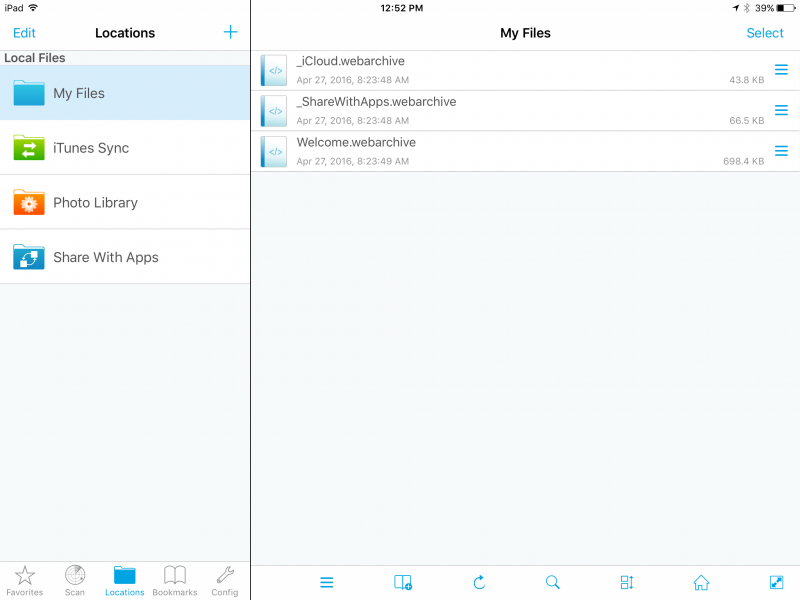

2. Add the connection to the X-drive. Tap the “+” to the right of “Locations”

	

3. Tap “Manual Setup”

	

4. Tap “PC” and scroll down.

	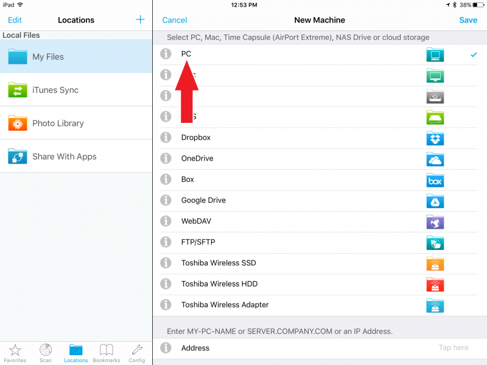

5. Tap the “Address” field and type “bakedbean.csun.edu” Tap “Advanced Settings” and type “X DRIVE”.

	

6. Tap “Done”. It will switch to “Save”. Tap “Save”.

	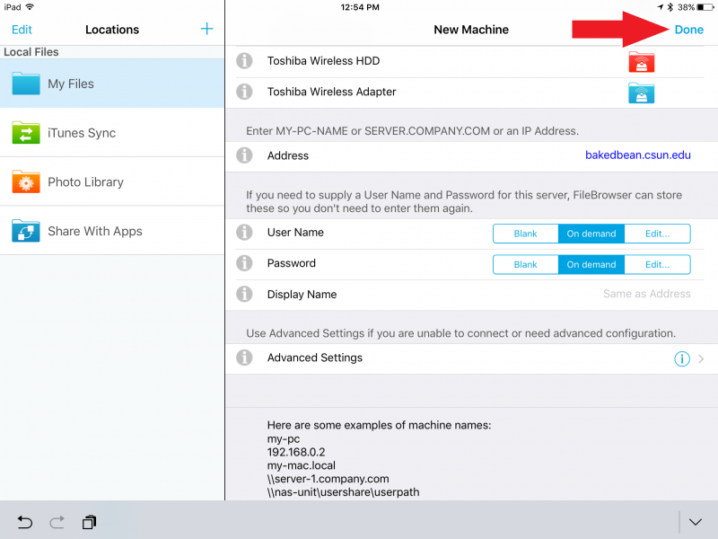

##Connecting to the X-Drive and Copying Photos
--------------------------------------------------------------------------
1. Open the FileBrowser app on your iPad.

	

2. Tap on “X Drive”.

	

3. When prompted, sign in using your CSUN user ID and password.

	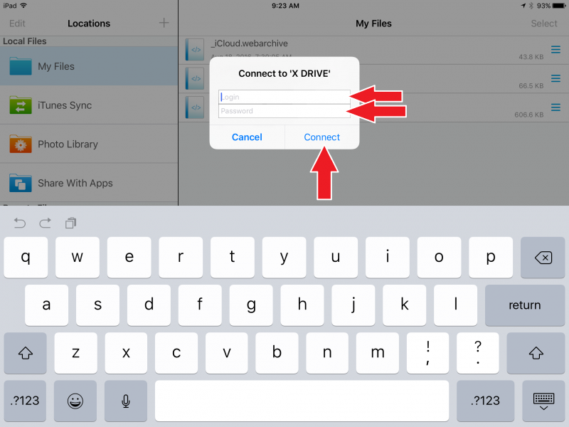

4. Tap on the “AS” folder.

	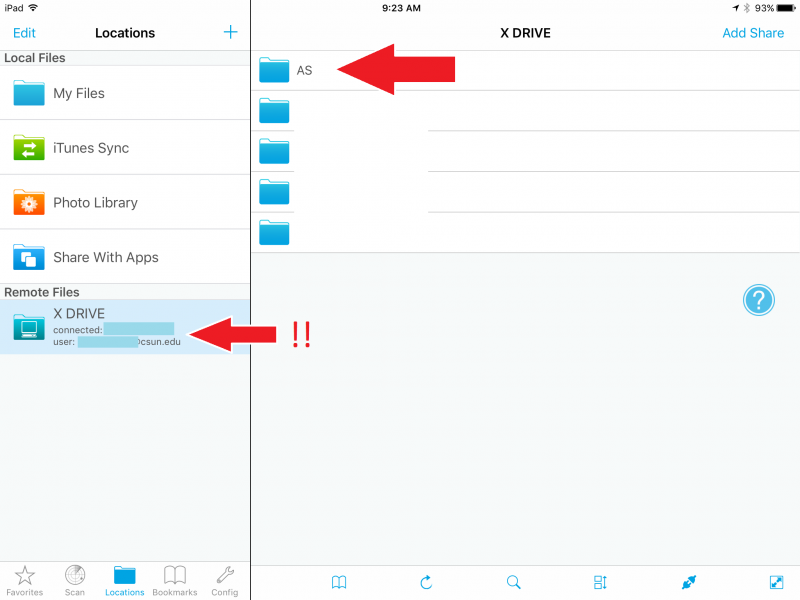

5. Tap on the “Children Center” folder.

	

6. Tap on the “AS-CC-Secure” folder.

	

7. Tap on the folder that you want to open. (For the purposes of this demonstration, “Teacher Public” was selected).

	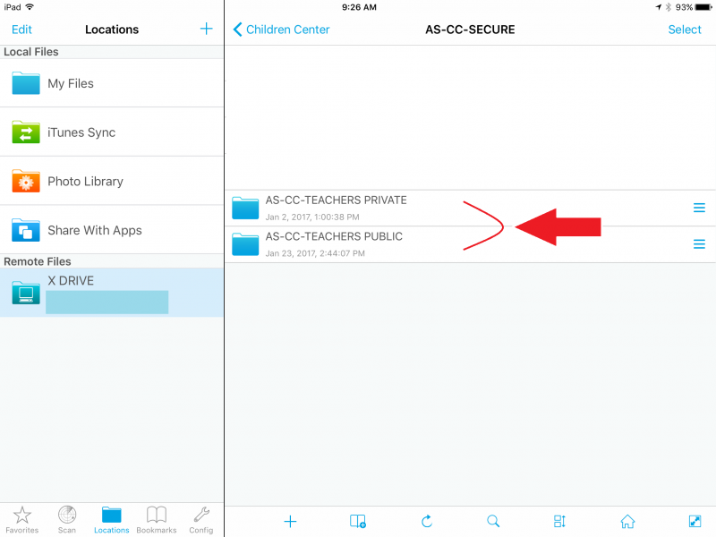

8. Tap on the folder that you want to open. (For the purposes of this demonstration, AS IT was selected).

	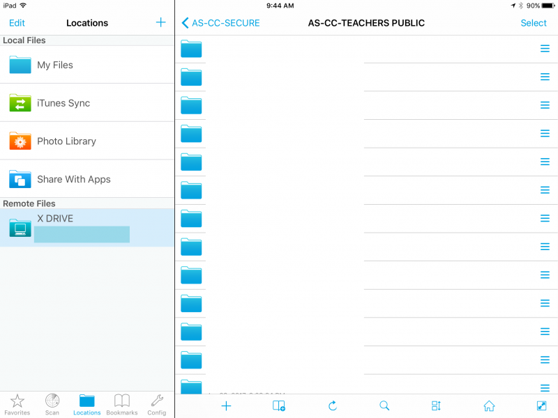

9. The name of the current folder will be displayed at the top. Verify that it is the folder that you want to save photos to.

	

10. Once you are sure that you are in the folder that you want to save to, you are now ready to browse to the Photo Library and select the photos from the iPad. To do so, start by tapping “Photo Library” on the left pane, then tap “Camera Roll”.

	

11. You should now see the photos that are stored on your iPad. Tap “Select”.

	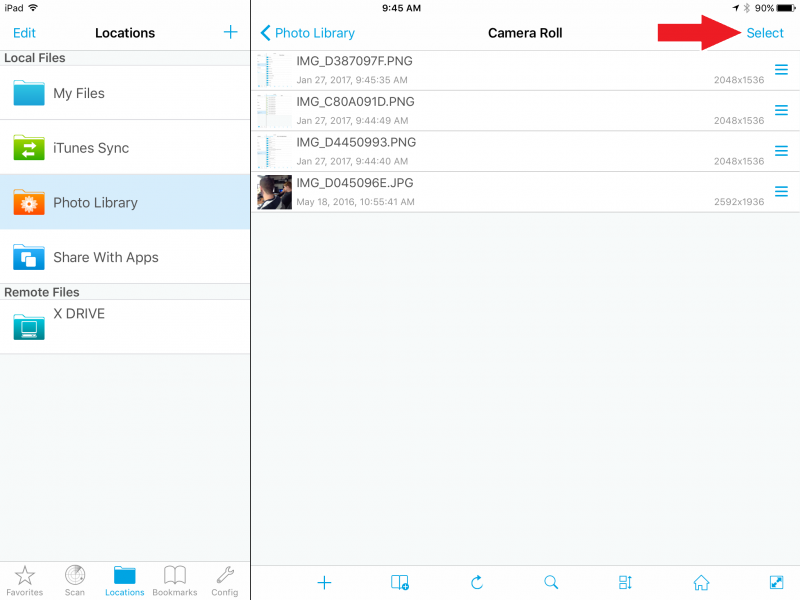

12. Tap the corresponding circle next to the photos that you want to copy.

	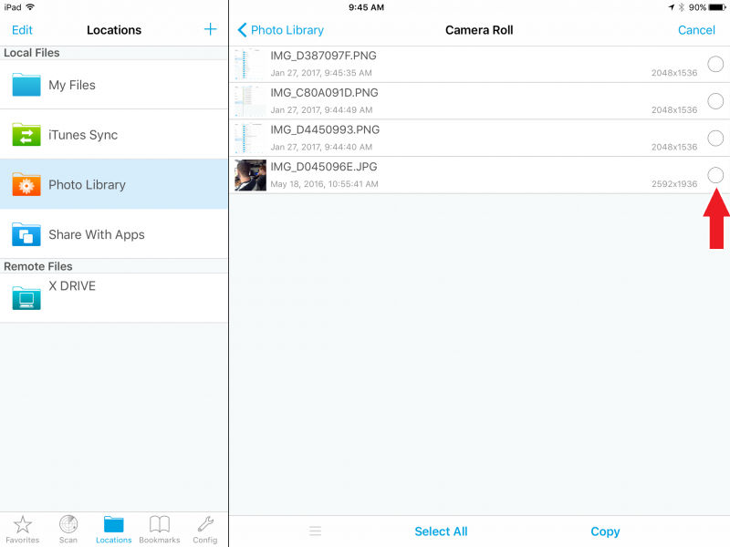

13. Verify that the photos that you’ve selected have the green checkmarks. Tap “Copy (X)” on the lower right.

	

14. If this message opens, tap “OK, don’t hint again”

	

15. Verify that you now see “X items selected” in the upper right. Tap “X Drive”.

	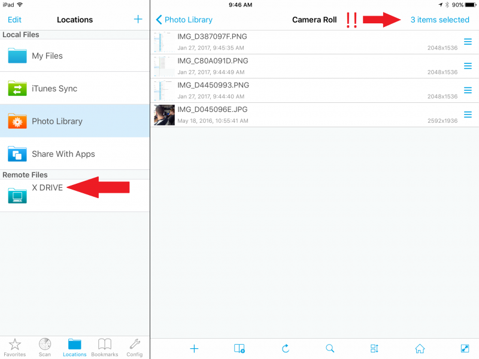

16. You should be back to the folder that you selected in step 9. Tap “Paste X files here…”

	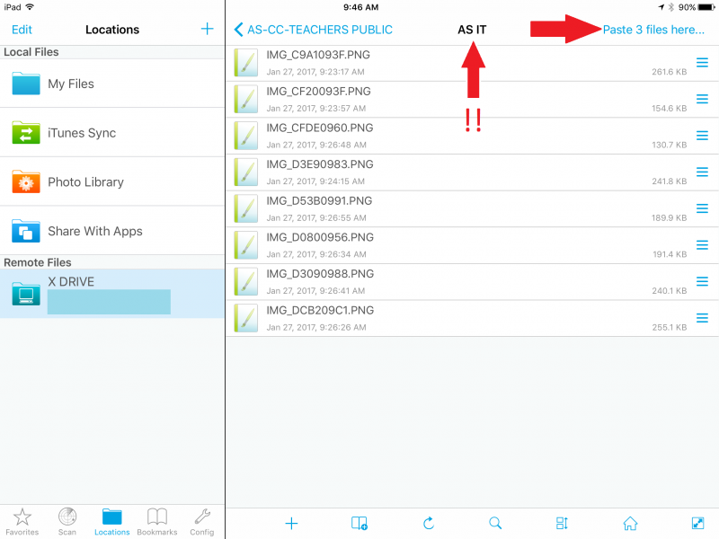

17. Tap “Paste X files here…” in the menu that opens.

	

18. Wait for your photos to copy. If they are still selected after copying, tap “Paste X files here” and tap “Cancel Selection”

	

19. After your photos have been copied, log out by first tapping the “Home” button.

	

20. Then tap the “unplug” button to log out.

	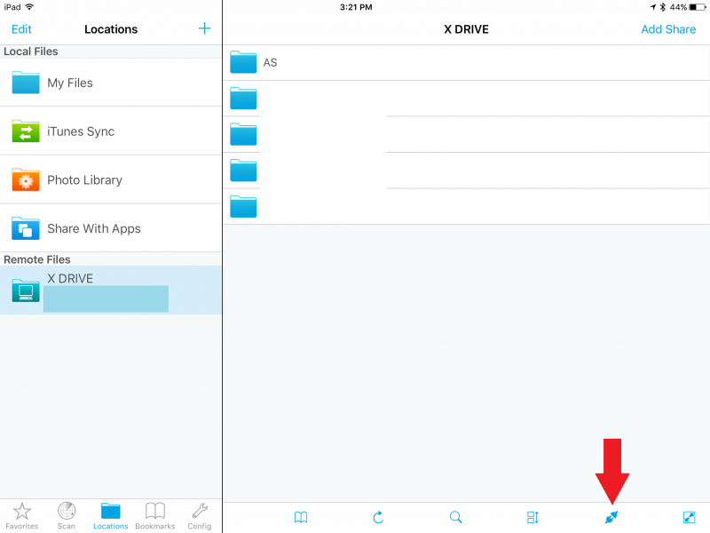

##Other Helpful Features
--------------------------------------------------------------------------
This section goes over additional features of the File Browser app that we found to be useful.

**Adding a Folder**

A new folder can be created anywhere, same as a regular Windows computer.
1. Open the File Browser app and go to the folder that you want to create a new sub-folder in. Then tap the “+” icon and tap “Add new folder”

	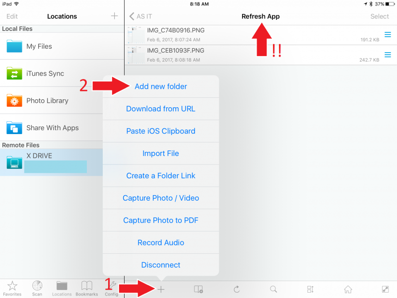

2. Give the folder a name and tap “Add Folder”.

	

3. Your new folder will now appear.

	

**Bookmarks**

Bookmarks allow you to “jump” quickly to a specific folder, avoiding the need to tediously tap through several sub-folders.
1. After you’ve signed in, go to the folder that you want to bookmark (the name at the top is the name of the folder that you’re currently in). When you are in the folder that you want to bookmark, tap the “Bookmark” icon to bring up the bookmark menu.

	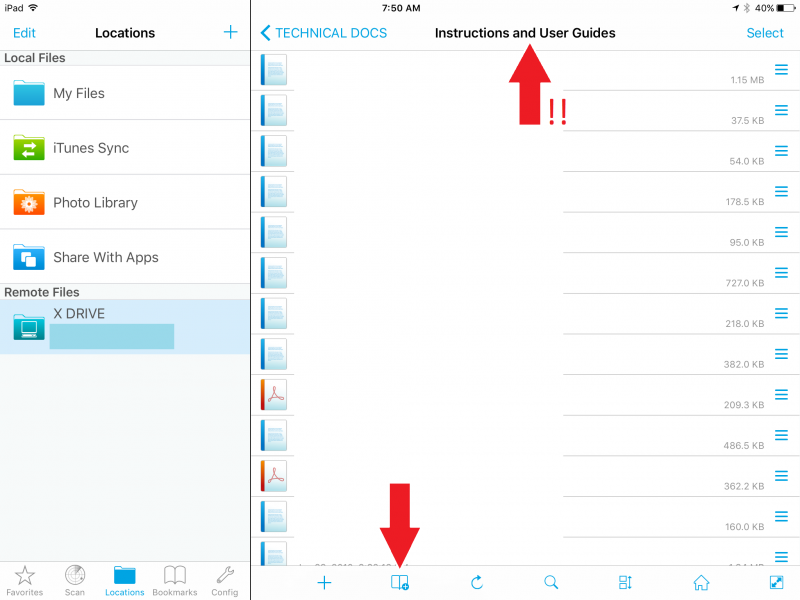

2. Tap the “+” icon to add a bookmark.

	

3. Give the bookmark a name (the default will be the name of the folder). Then tap “Add”.

	

4. Your bookmark is now created. You can tap the bookmark to go straight to that folder, or tap the “Bookmarks” icon to close the bookmarks menu.

	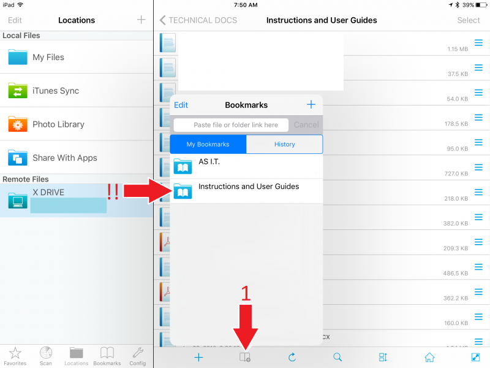

**Refreshing the Camera Roll**

If you take photos with the iPad while still signed into the File Browser app, then the new photos may not appear in the Camera Roll. To have them appear, refresh the folder: (This also works for any folder, not just the Camera Roll. The process is the same.)

1. Open your Camera Roll by tapping Photo Library > Camera Roll. Then tap “Refresh”.

	

2. Your new photos should now appear.

	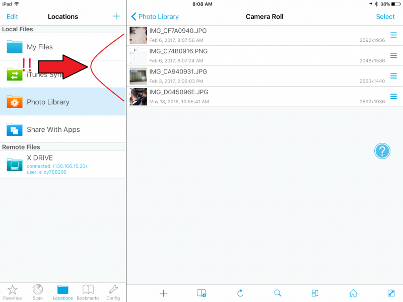

**Changing the Sort Order and Viewing Options**

By default, the files in a folder are sorted by "date modified", in a "list" format.
To change the sort order of items in a folder, simply tap the “sort” icon” and tap the appropriate options.

	

