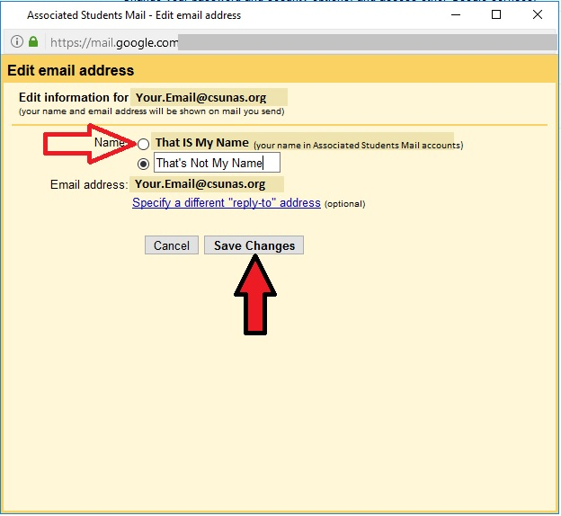

## Introduction
The purpose of this wiki is to guide you through the process to change certain settings and features in your AS Gmail account.

## Display Name
Your display name is the name that appears as the sender's name when you send emails from your AS Gmail account. Display names are configured by Associated Students IT, but users have the option of changing their display name separately. If your display name is incorrect, follow the steps below to check and change your display name.

### Check and Change Your Display Name

1. Log into your Associated Students gmail account. From your inbox, click on the "gear" in the upper-right corner of the screen, then click on "Settings".

2. Click on the "Accounts" tab.

 
3. Look for your display name (example circled in red). If this is incorrect, click on "Edit Info".

4. Click the upper radio button, which should have your correct display name next to it. Then click "Save Changes".
_NOTE: if the upper option is NOT correct, call AS IT at x8888_

5. Check that your display name has changed to the correct name (location circled in red).
