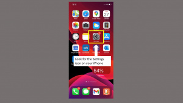
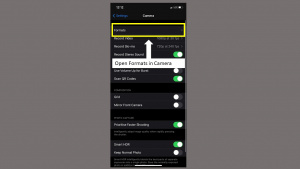

## Introduction
The purpose of this wiki is to guide the user through the process of changing certain settings in iOS.
### Changing default photo settings from HEIC to JPEG

1. Go to your iPhone home screen and tap on the "Settings" icon.

   

2. Scroll down, find "Camera", and tap on it..

   
 
3. Tap on "Format".
   

4. Select "Most Compatible".

   

5. The default photo settings have now been changed to JPEG. You may now exit settings and use your iPhone.
