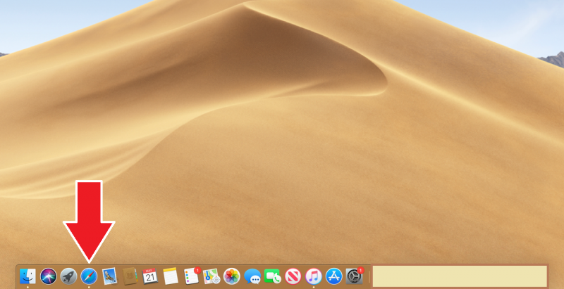
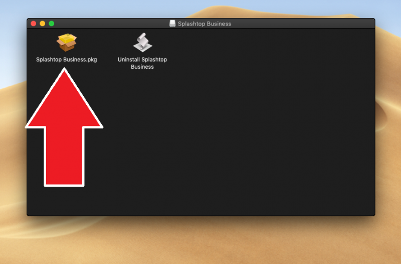
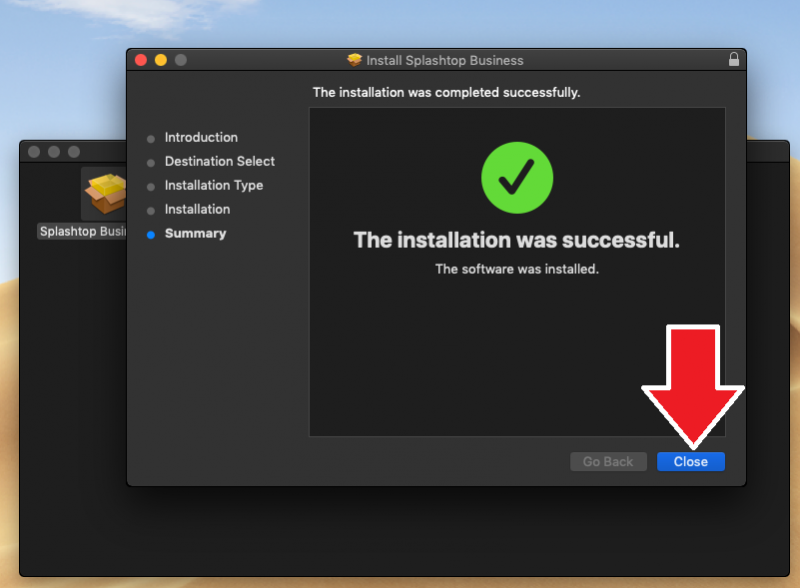
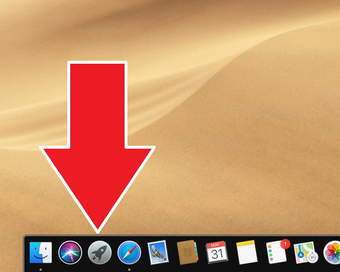
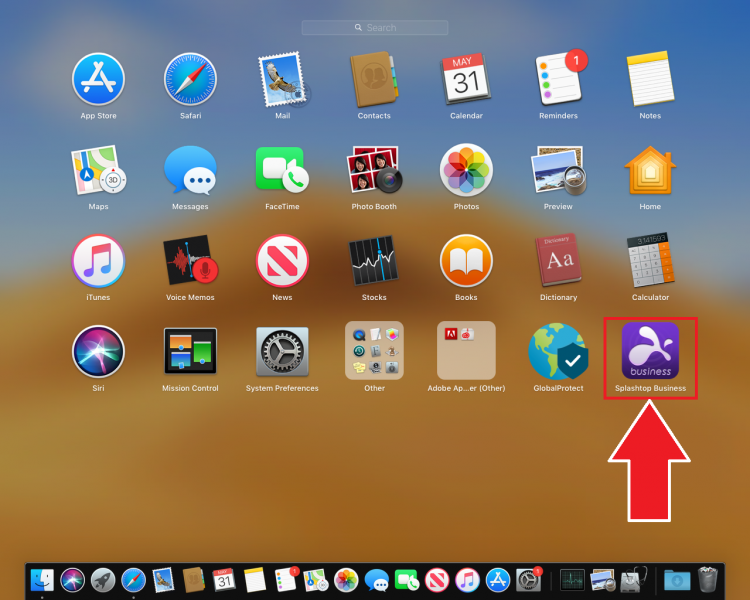
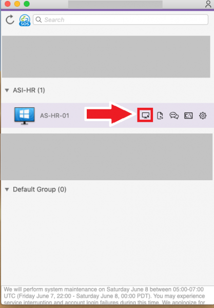
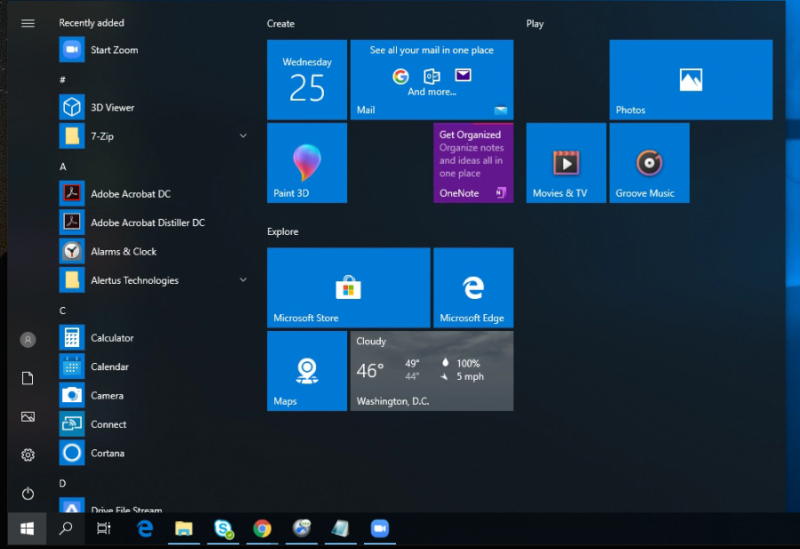
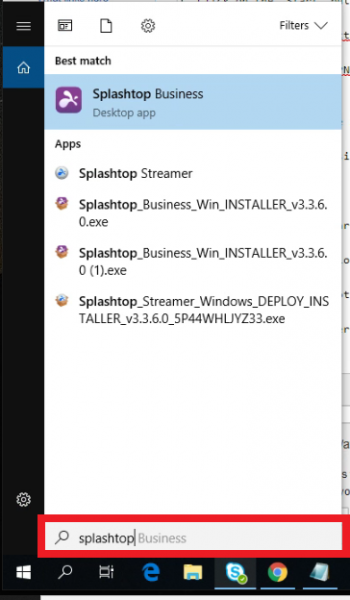
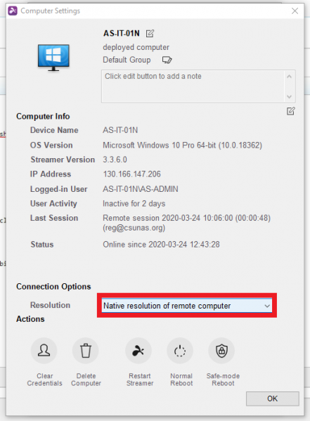
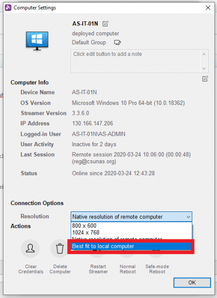

## Introduction
---------------

## Installing SplashTop Client On a MAC

-----------------
1. 1. Launch Safari from the Dock

	

2. Type "https://www.Splashtop.com/downloads" on the address bar on your web browser

	

3. Scroll down and click on "MACOS 10.7+".

	

4. Open the downloads tab and click on "Splashtop_installer_mac..."

	

5. Click the "Splashtop Business" icon.

	

6. Press next on the installer

	

7. Press "Install" on the installer

	

8.Enter the password you use to login to your MAC and install Splashtop

	

9. After Splashtop has installed, you can close the installer.

	

10. When Splashtop has successfully installed, move the installer to the trash.

	

11. Open launch pad.

	

12. Select "SplashTop business".

	

13. Enter your Splashtop Username and password, and check off the box that lets you stay logged in.

	

14. An AS I.T administrator will need to authenticate the computer that you are remoting from. The administrators will be notified automatically by email and will approve your request as soon as possible during normal business hours. Please call x8888 if you have any questions.

	

15. After your account has been verified, log back in and select "Connect" next to AS-HR-01

	

## Change Resolution Size on a Windows Computer
--------------
To change these settings, close or disconnect any "Splashtop" connections you might have open, and continue with the steps below.

1. Click on the "Start" button on the bottom left.

	

	

2. Type in "Splashtop" in the Search bar and the "Splashtop Business" application will appear.

	

3. Click on "Splashtop Business"

	

4. Click on your computer name.

	

5. Click on the "Info" gear icon.

	

6. In the "Connection Options" section, change the "Resolution" by clicking on the drop down box.

	

7. Click on "Best fit to local computer"

	

8. Click on "OK"

	

9. Click on the "Connect" button next to your computer name.

	