## Introduction
---------------
All CSUN students, faculty, and staff can use the Virtual Private Network (VPN) to access intranet-only resources from anywhere in the world. Additionally, the VPN can be used in conjunction with Remote Desktop to connect to your office computer remotely. Remote access must be granted via a request to AS-IT. If you have been given permission for remote access, follow the steps below to install the VPN client and the Remote Desktop application on your home computer. You will need administrator privileges on your home computer, as well as the name of your office computer, which AS-IT can provide.

## Installing the VPN Client on MacOS
-----------------
1. First, you need to launch Safari.

	

2. On your search bar, enter: https://www.csun.edu/it/downloads

	

3. Enter your CSUN username and Password.

	

4. Make sure you Download "GlobalProtect Virtual Private Network (VPN) Client".

	

5. The file should be downloading. You can access it by clicking on the downloads folder.

	

6. Select the "Global Protect" file.

	

7. Click "Continue" on the Global Protect Installer.

	

8. Make sure that "GlobalProtect" is checked off and click "Continue".

	

9. Make sure that you're installing "GlobalProtect" on "Macintosh HD". If it is not selected, press "Change install Location" and click on "Macintosh HD" and continue. Click "Install" after you have selected "Macintosh HD".

	

	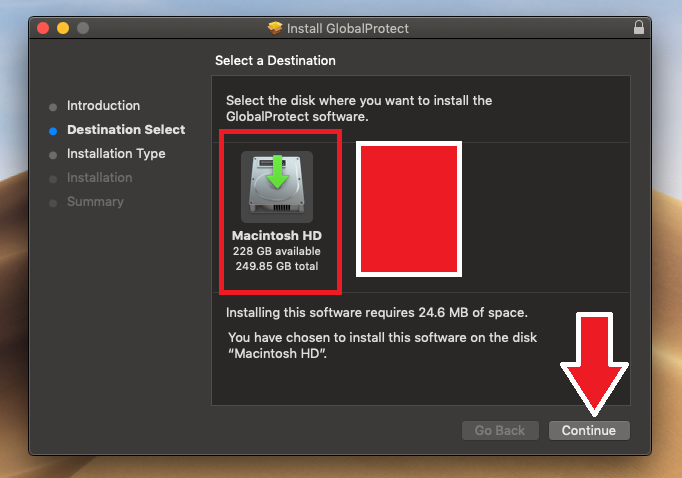

10. Enter your password to continue.

	

11. Global Protect should open and you will need to type "vpn.csun.edu" and hit connect. It might ask you to enter your CSUN credentials.

You can close the other windows and move the file to the trash.

	

12. Wait while the connection is being made. When it is successfully connected, you're all done!

	

-JA, JX

## Installing the Remote Desktop App on MacOS
----------------------------

1. Go to the Apple app store and search for "Microsoft Remote Desktop", select the app and click on it.

	

2. Click on "Get"

	

3. Click on "Install"

	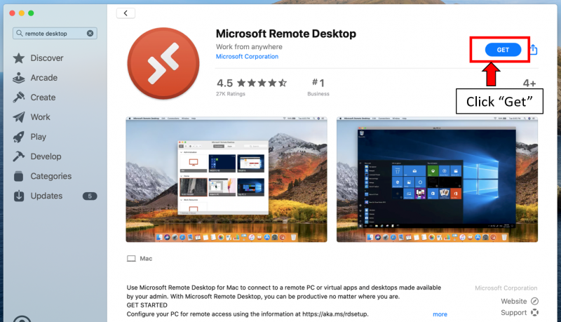

4. Enter your Apple ID Credentials, then click "Get"

	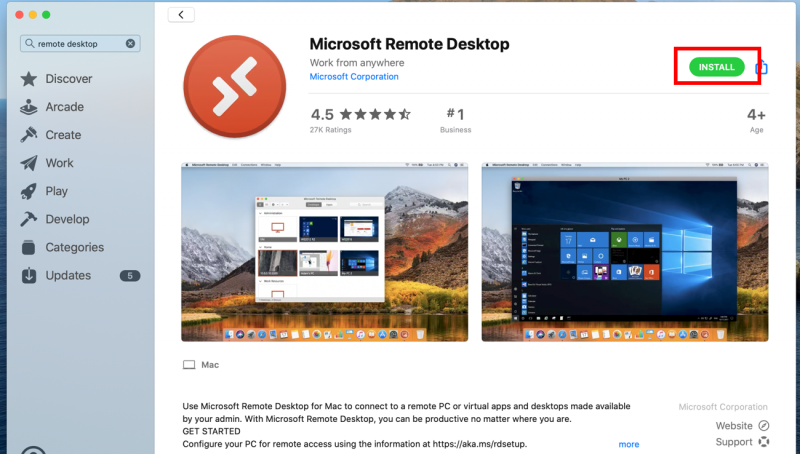

5. Click on "Open"

	

5. Click on "Not Now"

	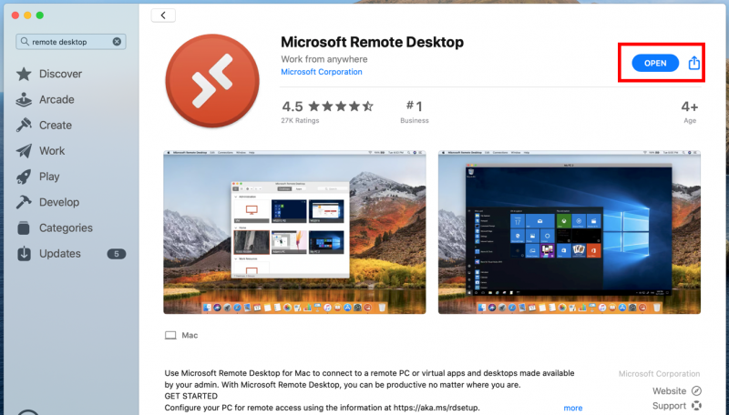

6. Click on "Continue"

	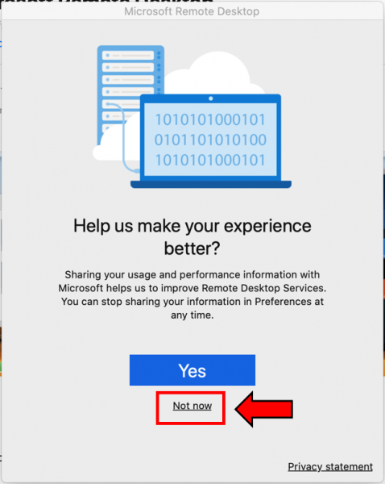

7. Click "Ok" to allow the application to use your microphone

	

8. click "Ok" to allow the application to use your camera

	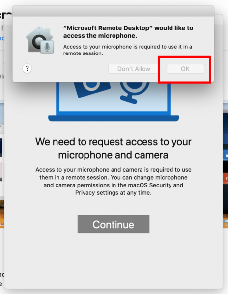

9. Click on "Add a PC" to add your workstation computer

	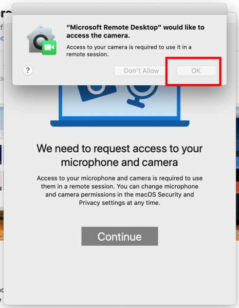

10. Enter your PC name, then click the "Display" tab

	

11. Check your settings and then click "Add"

	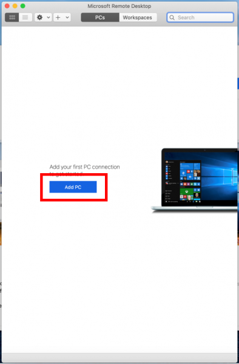

12. Double-click on the PC that you just added

	

13. Enter credentials, then click "Continue"

	

14. Click on "Continue"

	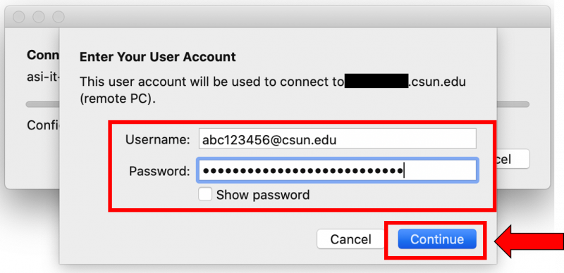

15.To make the menu bar appear, move your mouse cursor to the top of the screen.

	

## Installing the VPN Client on Windows 10
--------------
To change these settings, close or disconnect any "Splashtop" connections you might have open, and continue with the steps below.

1. Open a web browser (Chrome, FireFox, ect.)

	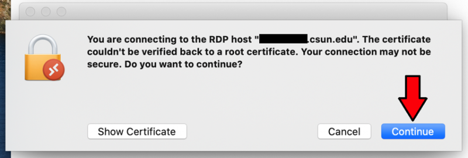

2. In the search tab, enter: https://www.csun.edu/it/downloads

	

3. Enter your CSUN credentials.

	

4. Download "GlobalProtect Virtual Private Network (VPN) Client 64-bit".

	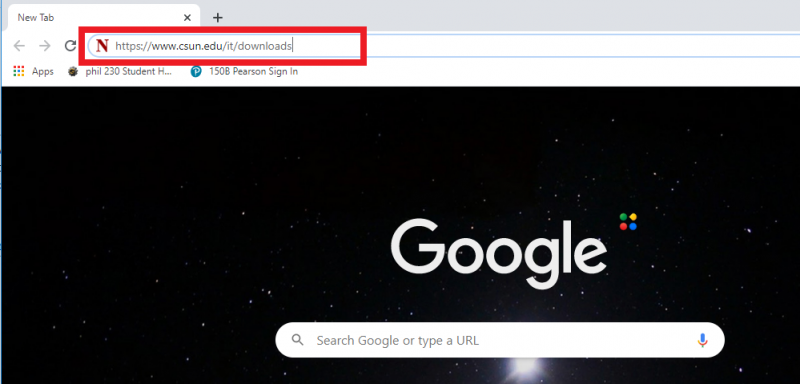

5. Open the file after it has been downloaded.

	

6. Click on next to advance to the next page.

	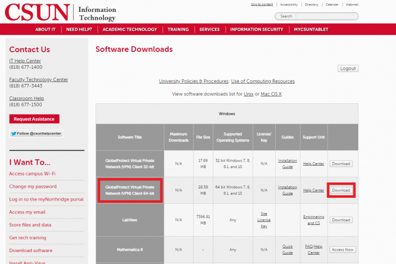

	

	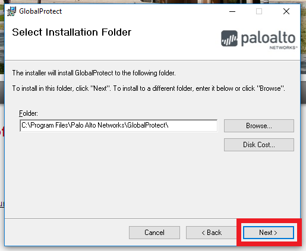

7. Click on "Close" after it is finished installing.

	

8. Click on the "Start" button

	

9. Type in "Global Protect" and click on "Global Protect" to launch.

	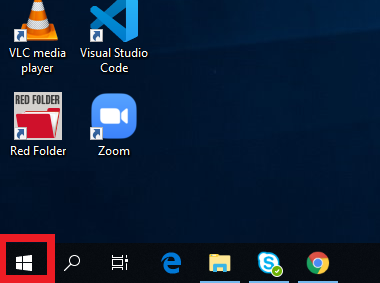

10. On the bottom right of your screen, Global Protect should be opened. Type in "vpn.csun.edu" and click on "Connect".

	

11. Enter your CSUN credentials and click on "Sign In".

	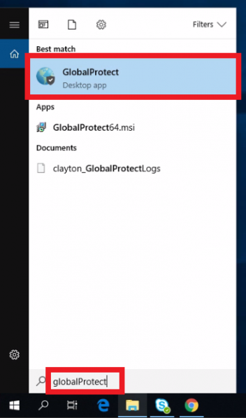

-JA, JX

## Installing Remote Desktop Connection on Windows 10
----------------------------------
For this part, you will need to know the name of your work computer. If you don't know your computer's name contact us at ext: 8888 or at techsupport@csunas.org

Make sure that Global Protect is connected and running. Please refer to the documentation above.

1. Windows 10 has Remote Desktop Connection installed as a built-in application. To open it, simply click on the "Start" button and type "Remote Desktop". Click on "Remote Desktop Connection".

	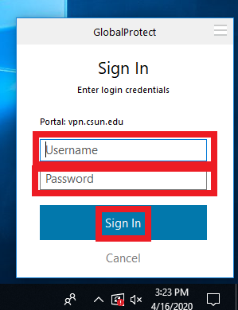

	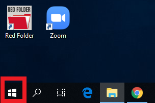

2. Click on "Show Options".

	

3. Enter your computer's name and your CSUN username followed by "@csun.edu". // Your username should be your first and last initial followed by some numbers.

	

4. Click on "Save As".

	

5. Scroll up or down if needed and click on "Desktop".

	

6. For the "File name," enter your computer's name and click on "Save".

	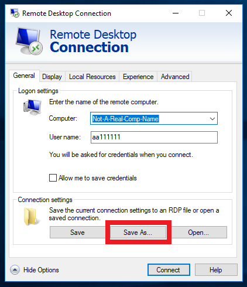

7. Go back to your desktop and click on the shortcut you just created.

	

8. Check on the box that says "Don't ask me again for connections to this computer" and click on "Yes".

	

9. Enter your CSUN password, and you should be connected to your work computer.

	

When you want to connect to your work computer, all you have to do is click on the shortcut you created and enter your CSUN password.

-JA, JX

