## Introduction
---------------
The purpose of this article is to show highlighted features of Zoom. Full documentation on using Zoom can be found at: https://www.csun.edu/it/zoom

## Zoom on Windows 10
-----------------
This section describes using certain features of Zoom on the Windows 10 platform.

**Downloading and Installing Zoom**

1. Go to https://csun.zoom.us/download

2. Click on “Download” under “Zoom Client for Meetings”.

	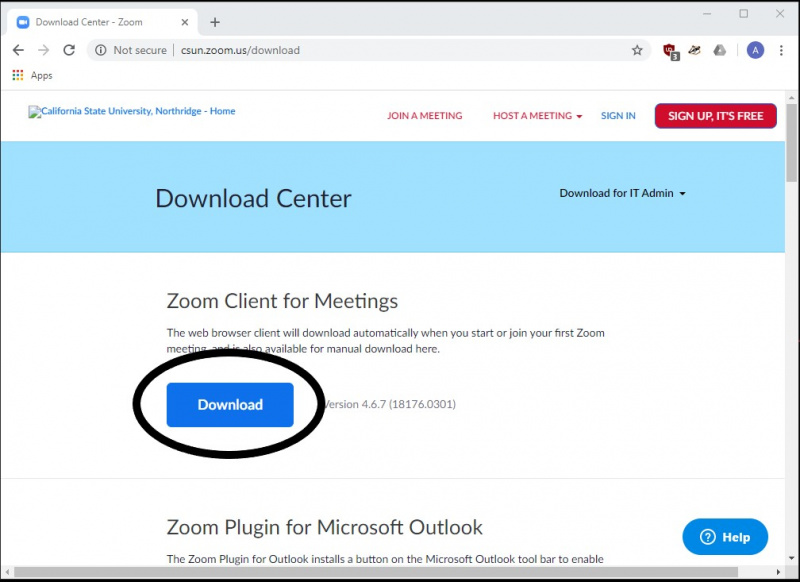

3. Click on the installer that appears at the bottom.

	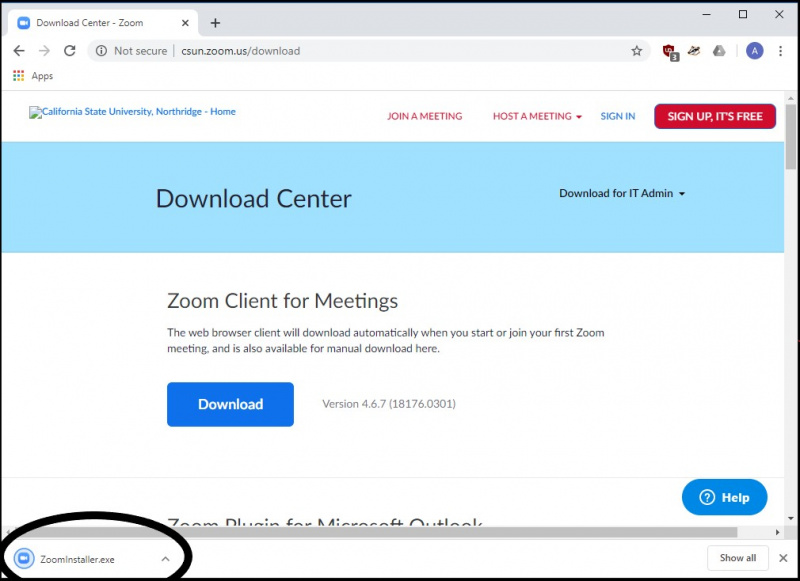

4. Allow the installer to run. Once finished, you will be at the launch screen.

	

**Launching Zoom**

Once Zoom is installed, it can be launched by clicking the "Start" button and scrolling down to "Zoom".
	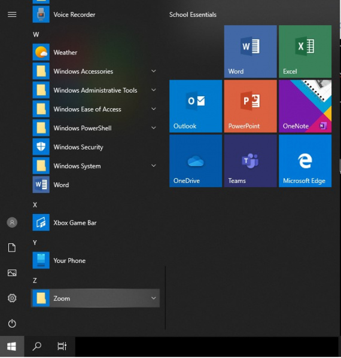

**Joining a Zoom Meeting**

If you received an email invitation to a Zoom meeting, simply click on the link in the invitation.

If you did not receive an invitation, ask the meeting organizer for the meeting ID number and follow the steps below to join the meeting.

1. Launch Zoom

2. At the launch screen, click “Join a Meeting”.

	

3. Enter the Meeting ID (provided by the Meeting Organizer), a Screen Name (visible to other attendees), and click “Join”.

	

**Hosting a Zoom Meeting**

1. Launch Zoom.

2. At the launch screen, click "Sign In".

	

3. Click "Sign in with SSO".

	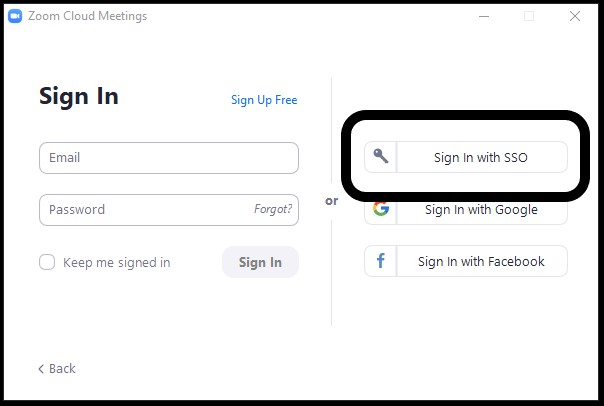

4. Type "CSUN" in the box, then click "Continue".

	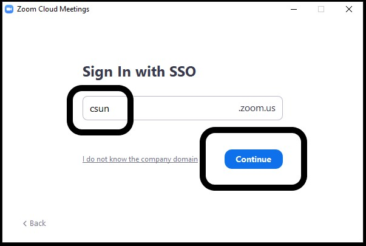

5. Your web browser will open the CSUN SSO page. Enter your CSUN credentials and click "login".

	

6. Depending on your web browser, Zoom may launch automatically, or ask for permission. If your web browser asks to launch Zoom, click "Open Zoom Meetings".

	

7. From the home screen of Zoom, click "Schedule".

	

8. In the "Schedule a Meeting" window that opens, fill in the "Topic" section as applicable. The "Video", "Audio", and "Options" settings can be left as default for the majority of meetings. Under the "Calendar" section, click "Other Calendars". Then click "Schedule".

	

9. In the window that opens, click "Copy to Clipboard" to copy the meeting information. Then click the "X" in the top-right of the window to close it.

	

10. Open your email application (Outlook, Gmail, Apple Mail), compose a new email, and paste the meeting information. Send the meeting information via email to whomever needs to attend the meeting.

**Finding Your Meeting ID**

If you are the Meeting Organizer and need to find the meeting ID for a meeting that you scheduled, follow the steps below.

1. Launch Zoom.

2. On your home screen, any scheduled and upcoming meetings will show on the right-side of the screen, with the Meeting ID. Give this Meeting ID to anyone that needs to join.

**Resend a Meeting Invitation**

If you would like to resend a meeting invitation, follow the steps below.

1. Launch Zoom.

2. From the home screen of Zoom, click "Meetings".

3. Scroll down to the desired meeting and click "Copy Invitation".

4. Open your email application (Outlook, Gmail, Apple Mail), compose a new email, and paste the meeting information. Send the meeting information via email to whomever needs to attend the meeting.

**Using the "Raise My Hand" Feature**

###### As a Host

If you are the host you'll be able to lower hands and view how many hands are raised.

To lower hands, follow the steps below.

1. Click on "More".

	

2. From the "More" menu, click on "Manage Participants".

	

3. To lower all hands in the "Manage Participants" page, click on "More".

	

4. From the "More" tab, click on "Lower all hands".

	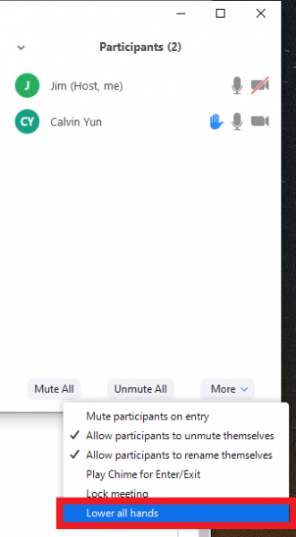

5. If you want to lower only one hand, in the "Manage Participants" page hover over the person's name and click on "Lower Hand".

	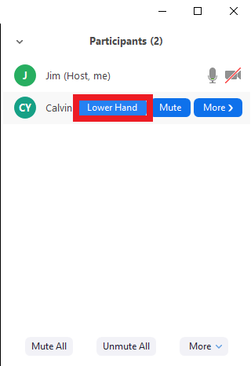

-ja,jx

**As a Participant**

If you're a participant and you would like to raise your hand, follow the steps bellow.

1. Click on "More".

	

2. In the "More" menu, click on "Participants".

	

3. In the "Participants" menu on the bottom right, click on "Raise Hand"

	

4. To lower your hand in the "Participants" menu on the bottom right, click on "Lower Hand".

	

-ja,jx

**Adding Alternate Hosts**

If you are scheduling a Zoom meeting and you want to add an alternate host, follow the steps below.

1. Click on the "Start" button on the bottom left.

	

	

2. Type in "Zoom" in the search box and the Zoom application should appear.

	

3. Click on "Start Zoom".

	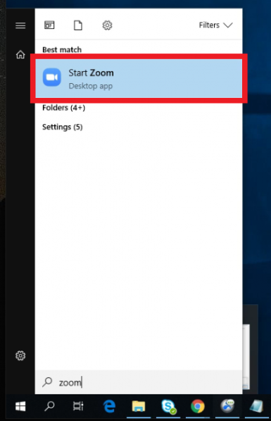

4. Click on "Schedule".

	

5. Click on "Advanced Options"

	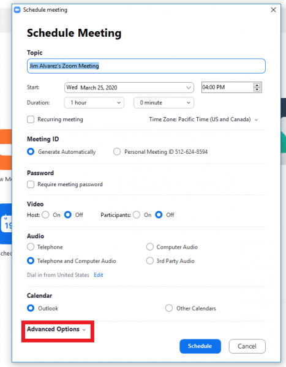

6. In "Alternative Hosts" enter the email address of the alternate host you want to add, and continue with the scheduling.
**The alternative host will receive an email letting them know that they have been added as an alternative host.**

	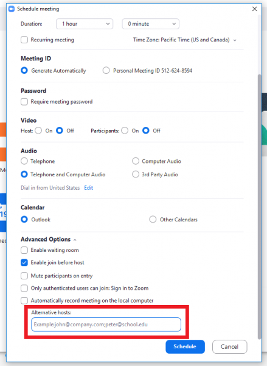

-ja,jx

**Giving Host Control to Someone**

If you are the host, you can make someone else the host. You'll then turn into a participant with no host privileges, but you can regain host controls if you started the meeting.

If you want to make someone else the host, follow the steps below.

1. Click on "More".

	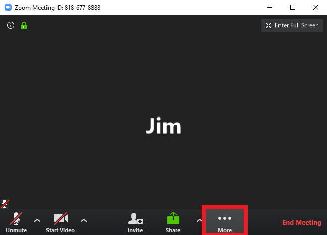

2. In the "More" menu, select "Manage Participants".

	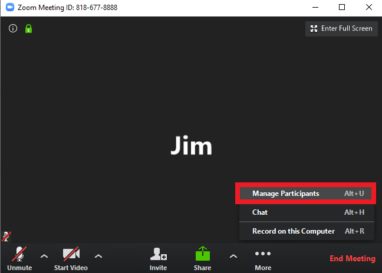

3. Hover over the person you want to make a host and click on "More".

	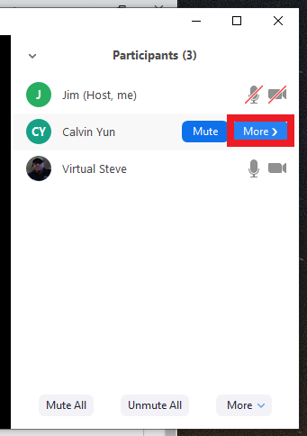

4. Click on "Make Host"

	

-ja,jx

**Breakout Room**

"Breakout rooms are sessions that are split off from the main Zoom meeting. They allow the participants to meet in smaller groups. Breakout rooms can be used for collaboration and discussion of the meeting."

###### As a host or co-host

As a host you can create the break room, and assign who you'll want to be in the break room. To create the break room follow the steps below,

###### Creating Breakout Rooms

1. Click on "More". If "More" doesn't appear skip to step 2.

	

2. There's 2 different ways the breakout room button will appear. Check which screen looks similar to yours and click on "Breakout Rooms".

	

	

3. Enter the number of breakout rooms you'll want to create, and select "Automatically" to randomize the participants into a room. Zoom will tell you how many participants will be in each breakout room.

	

4. Click on "Create Rooms".

	

5. Click on "Open all Room".

	

-ja,jx

**Move participants in Breakrooms**

You will need to have more then one breakout room to move participants.

To move participants to different breakout rooms, follow the steps below,

1. Open the breakout room menu.

	

2. Hover over the participant and select "Move to".

	

3. Click on the breakout room you want to move the participant to.

	

-ja,jx

**Joining different breakout rooms**

As the host, you're able to join different breakout rooms after they have been created and opened. Follow the instructions from above to create breakout rooms and open them.

To join different breakout rooms, follow the steps below.

1. Click on "Breakout Rooms". If "Breakout Rooms" doesn't appear click on "More" and then "Breakout Rooms".

	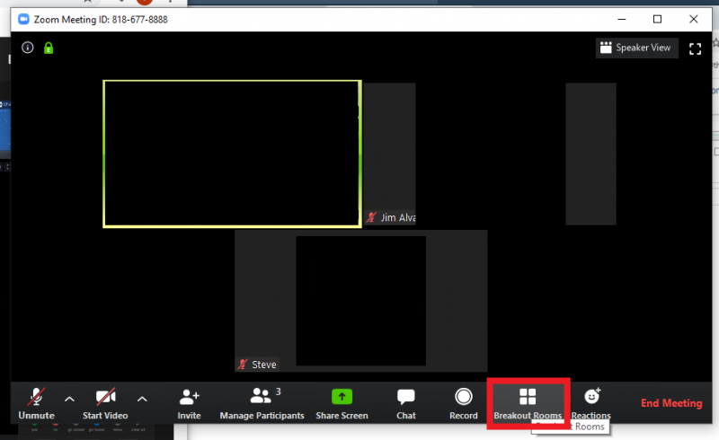

	

2. Click on "Open All Rooms".
*Note that the breakout rooms might already be open.*

	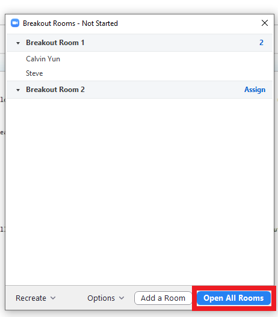

3. Click on "Join" next to the room you want to join.

	

4. Click on "Yes join room"

*Note if some participants aren't assigned to a breakout room you can click on the arrow next to "Unassigned" and hover over the participants name and click on "Move to".*
	

5. To join a different breakout room follow the instructions again, but click join on a different room.

-ja,jx

**As a participant**

*Join a Breakout Room*

To join a breakout room as a participant, follow the steps below.

1. Click on "More".

	

2. Click on "Join Breakout Room".

	

3. Click on "Join Breakout Room".

	

-ja,jx

**Leave Breakout Room**

To leave the breakout room make sure that your "Zoom window" is a large size. If your "Zoom window" is too small, the "Leave Breakout Room" button will not appear.
If your screen is too small, click on the side of the window (The mouse will turn into two arrows on each side) and drag it bigger.
See the example below.

	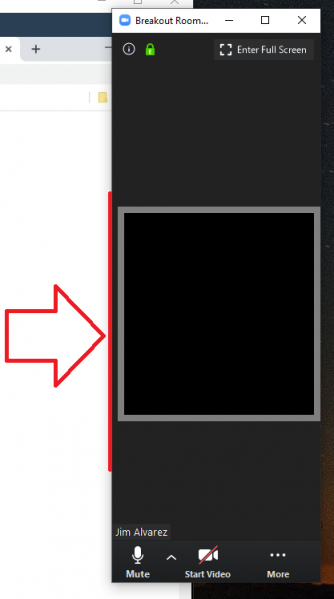

	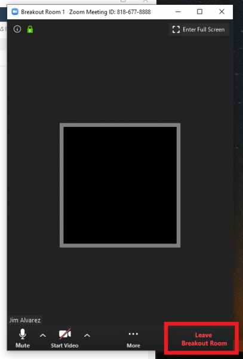

Follow the steps below to leave a "Breakout Room"

1. Click on "Leave Breakout Room"

	

2. Click on "Return to Main Session"

	

-ja,jx

**Using Polling Feature

"The polling feature for meetings allows you to create single choice or multiple choice polling questions for your meetings. You will be able to launch the poll during your meeting and gather the responses from your attendees. You also have the ability to download a report of polling after the meeting."

You'll need to make sure that Zoom is up to date. You can scroll down to "2.12 update Zoom" for instructions on updating zoom.

There would be multiple choice questions created and the participants can vote. Only the Host that created the meeting will be able to create the polls, the Co-hosts can only launch the polls, share results, and can NOT vote.

If you make someone else the host they won't be able to create polls.

###### Enabling the Polling Feature.
The Host of the meeting will need to have this feature enabled.

1. Open web browser and go to https://zoom.us/signin

	

	

2. Sign in with SSO

	

3. "Your Company Domain": CSUN

	

4. Enter CSUN credentials

	

5. On the left select "Settings". Note that the web browser window should be large, so the settings will appear.

	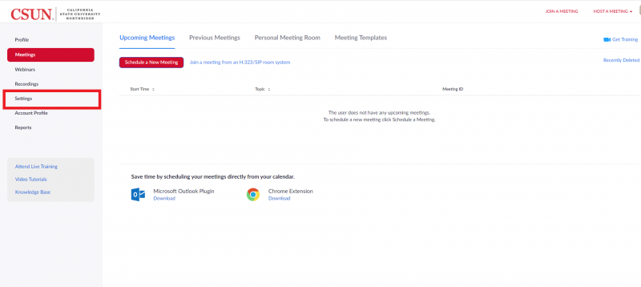

6. Confirm you're in the meetings tab and click on "In Meeting(Basic)".

	

7. In the "In Meeting (Basic)" section look for the "Polling" option and click on the grey button.

	

Now when you schedule a meeting the polling feature will be available.

-JA

Creating the polls *In Progress Meeting*
The meeting needs to have been scheduled. If you just start a meeting using "New Meeting", the polls feature won't appear.

1. Click on "Polls" or on "More" if "Polls" doesn't appear.

	

	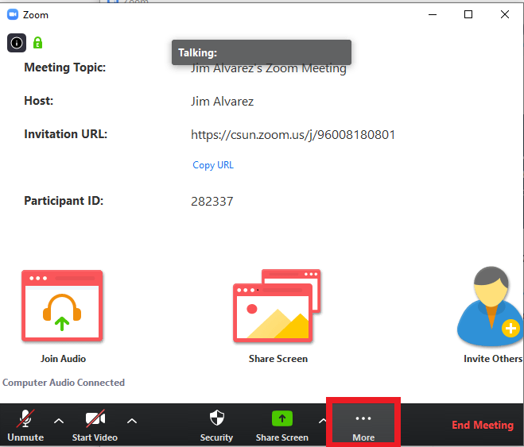

	

2. Click on "Add a question".

	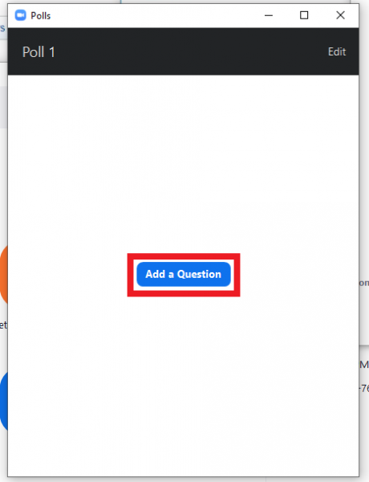

3. The web browser will appear. Fill in the information as needed.
"(Optional) Check the box to make the poll anonymous, which will keep the participant's polling information anonymous in the meeting and in the reports.
Select whether you want the question to be single choice(participants can only choose one answer) or multiple choice question(participants can choose multiple answers)."

	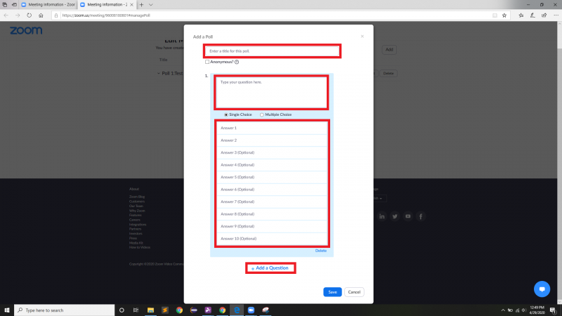

4. Click on "Save".
	
	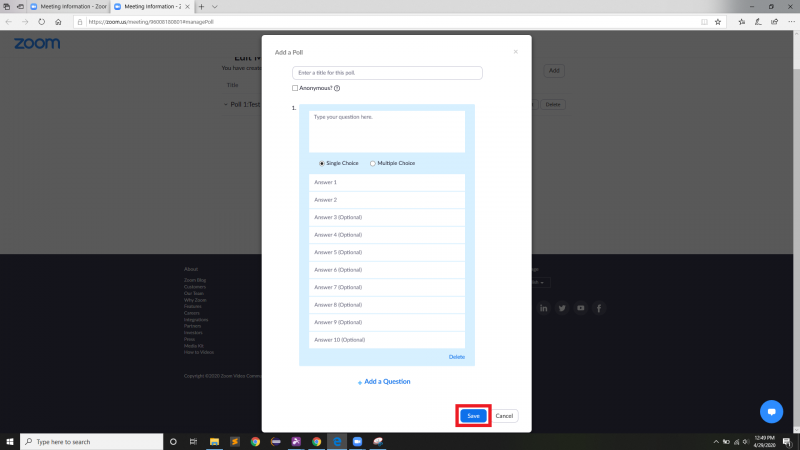

5. Go back to your zoom meeting and click on "Launch Polling".

	

-JA

**Creating the polls before scheduled meeting**

If you scheduled a meeting and already enabled the polling feature.
You can create the questions before the zoom session starts.
1. Open web browser and go to https://zoom.us/signin

	

	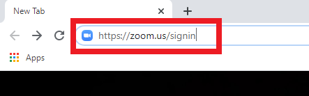

2. Sign in with SSO

	

3. "Your Company Domain": CSUN

	

4. Enter CSUN credentials

	

5. Confirm that you're in "Meetings" and in "Upcoming Meetings".
Click on the meeting topic.

	

6. Scroll to the bottom where it says "You have not created any poll yet." and click on add.

	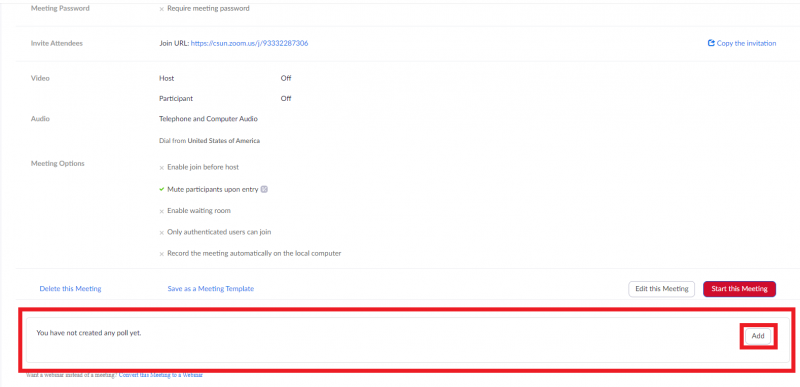

7. Enter a title for the poll. Fill in the questions, answers and click on "Save".
"(Optional) Check the box to make the poll anonymous, which will keep the participant's polling information anonymous in the meeting and in the reports.
Select whether you want the question to be single choice(participants can only choose one answer) or multiple choice question(participants can choose multiple answers)."

	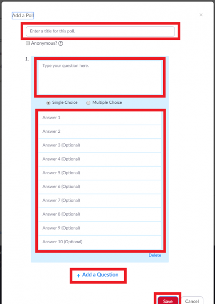

-JA

**Update Zoom**

To update Zoom you need to make sure you're not in a Zoom Meeting.

1. Click on the "Start" button and type in "Zoom" and click on "Start Zoom".

	

	

	

2. Click on your profile picture.

	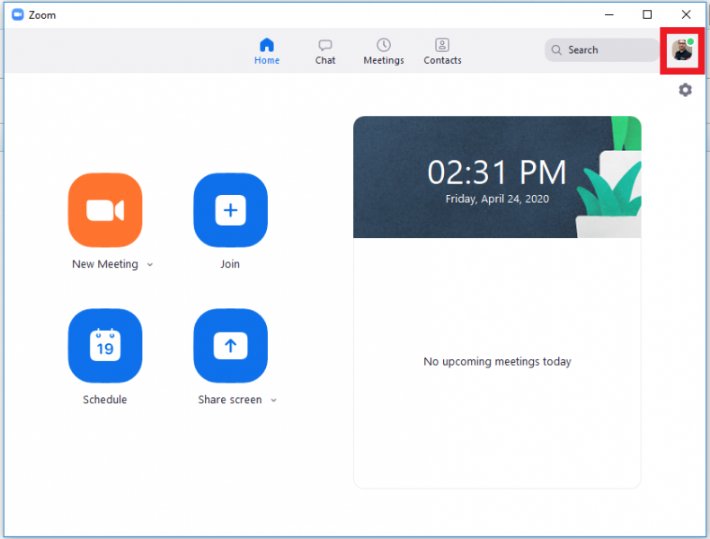

3. Click on "Check for updates".

	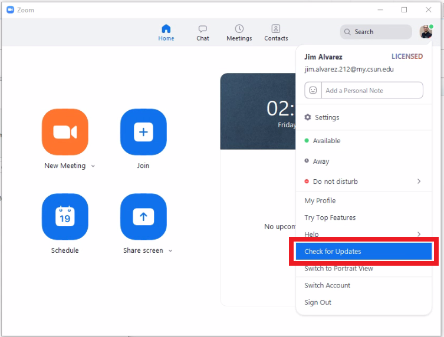

4. If there's an update available it'll begin downloading.

	

When it's done downloading it'll give you the option to update now or later.
Click on "Update".
	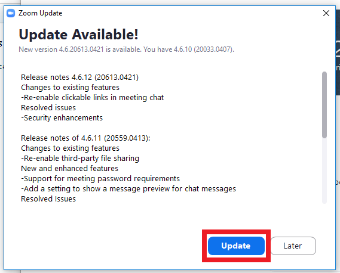
Zoom should restart and open up again.
If there's no update available it will say "you are up to date".
	

-JA

**How to Create a Departmental Virtual Office**

The purpose of this documentation is to create a Virtual Departmental Office for users in the department to constantly use for their meetings. One designee (a person) will have to be selected. This designee will be the primary host of the Virtual Office meeting. Additional "alternate" hosts can be added, but the designee retains authority to reclaim the position of host of the Virtual Office at any time. The designee will also have to make modifications to their Zoom profile settings, as described below. Once the designee (from here on called "main host") is chosen, that host will have to complete the meeting settings below. Although not required, it is HIGHLY recommended that the main host change their Personal Meeting ID to match that of their department's phone number. The department phone number to use must be decided before continuing.

To create a departmental virtual office, follow the instructions below.

**Required Zoom Settings for Main Host**
These steps must be completed by the main host as described at the beginning of the section.

1. On a desktop or laptop computer (NOT a mobile device such as a cell phone or iPad), log into the Zoom profile (web) settings at www.csun.zoom.us At the Zoom website, click "Manage Your Profile"

	

2. Input your CSUN Credentials, then click "Login"

	

3. Next, click on the "Settings" tab

	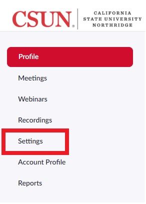

4. Click on the "Meeting" tab

	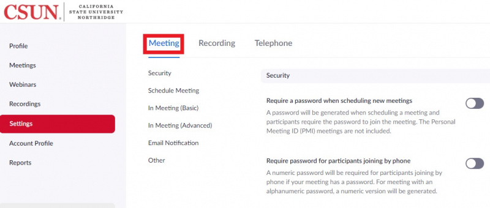

5. ALLOW the following settings:

     -Waiting Room
     -Sound notification when someone joins or leaves (Play sound for everyone)
     -File Transfer
     -Co-host
     -Screen sharing (all participants)
     -Allow removed participants to rejoin
     -Breakout room

	

	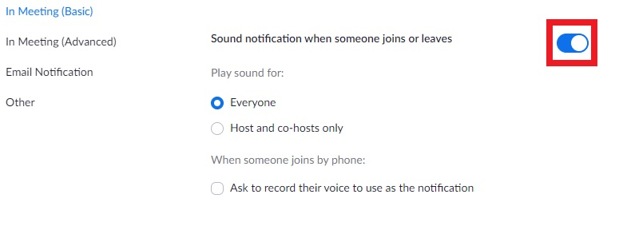

	

	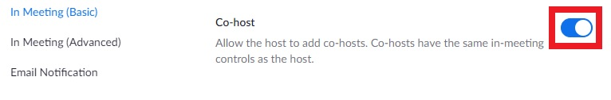

	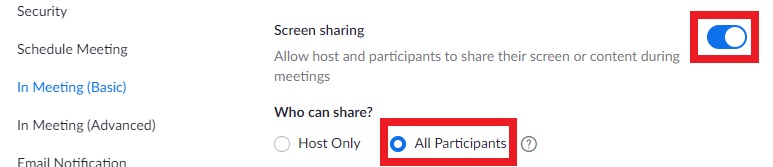

	

	

6. Click on "Recording" tab. Scroll down and turn OFF automatic recording.

	

**Create the Virtual Office Zoom Meeting**
These steps must be completed by the main host, described at the beginning of the section.

1. On a desktop or laptop computer (NOT a mobile device such as a cell phone or iPad), log into the Zoom profile (web) settings at www.csun.zoom.us

	

2. Click on "Profile". Look for "Personal Meeting ID". Click on "Edit" to the right. Change the Personal Meeting ID with the agreed-upon department phone number. Click "Save Changes".

	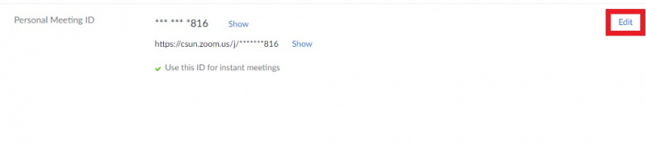

	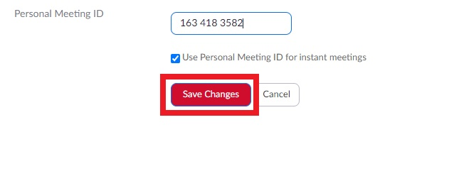

3. Click on "Meetings".

	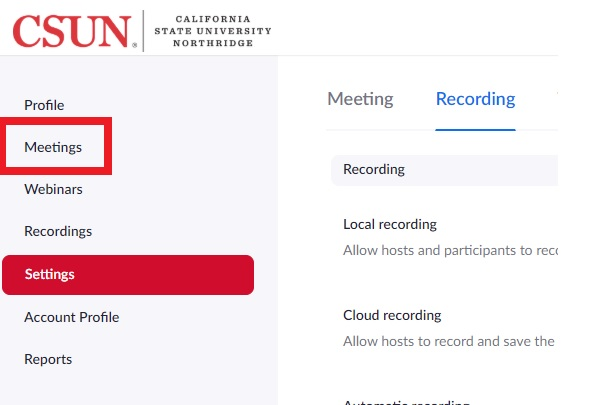

4. Click on "Schedule a new meeting".

	

5. Enter the following settings:

	Topic: AS <DEPARTMENT NAME> Virtual Office
   	Description: <as desired>
   	When: skip for now (it disappears with a later setting)
   	Recurring Meeting: Yes
   	Recurrence: No Fixed Time
   	Meeting ID: Personal Meeting ID
   	Meeting Password: <as desired>
   	Video: Host ON, Participant ON
   	Audio: Both
   	Meeting Options:
     		-Enable Join Before Host: No
     		-Mute Participants upon entry: No
     		-Enable waiting room: Yes
     		-Only authenticated users can join: No
     		-Record the meeting automatically on the local computer: No
  	Alternative Hosts: as desired, must be @csun.edu or @my.csun.edu email addresses only, separated by commas.
  	Then click "Save"

	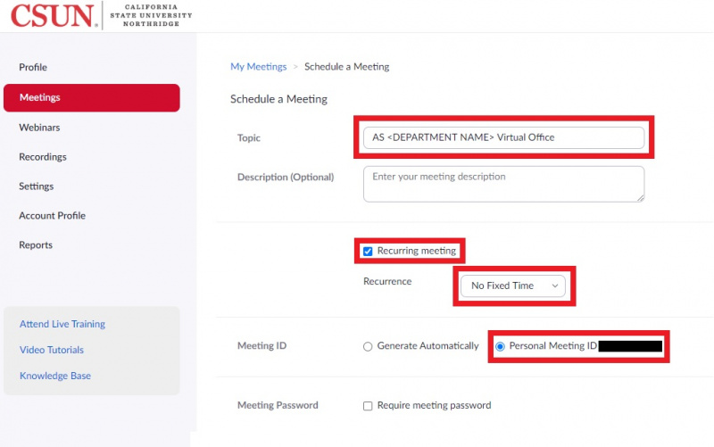

	

**Using the Virtual Office**

Any of the Alternative Hosts can start ("open") the Virtual Office at any time. If an Alternative Host joins the meeting ("opens" the Virtual Office) before the Main Host, that Alternative Host will join as the Host. However, the Main Host can join the meeting at any time, and only the Main Host has authority to reclaim the position of Host at any time. Only one person can be given the position of Host at any time.

If the Host tries to leave, they will be warned to make someone else the host, otherwise the meeting will end (the Virtual Office will "close") for everyone. Please refer to the instructions found here: http://www.csunas.org/it/Zoom#Giving_Host_Control_to_Someone

To create and use breakout rooms, please refer to the instructions found here: http://www.csunas.org/it/Zoom#Breakout_Room

-PA, JA, JX, CY

##Start a Departmental Zoom Meeting and Join breakout Rooms##

1. Open up any web browser and search for "csun.zoom.us".

	

2. Click on the very first link which is "CSUN Zoom".

	

3. Click on "Manage Your Profile".

	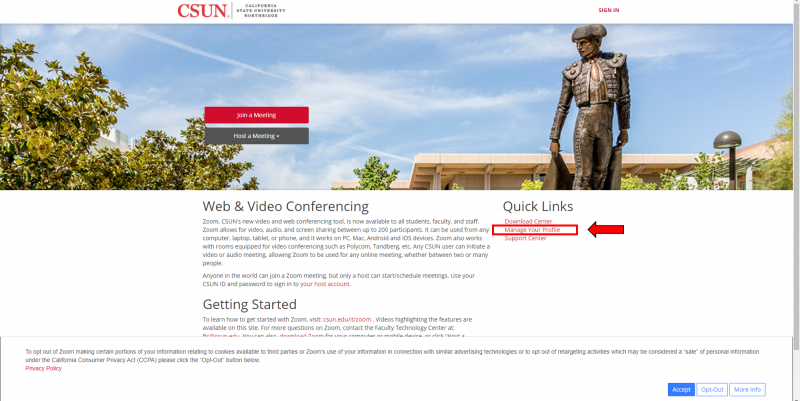

4. Enter your CSUN departmental zoom username and password and click on Login.

	

5. When you first login, you will see your profile page. Go ahead and click on "Settings" located on the left.

	

6. On this page, you will see all of your scheduled meetings. In order to start a meeting, hover your mouse over the meeting that you would like to start and click on the blue "Start" button.

	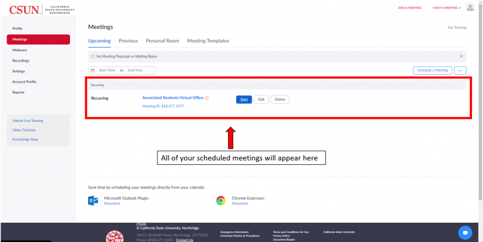

7. You will now be redirected to a new windows where you will have to click on the "Open Zoom Meetings" in order to open the meeting in the Zoom software.

	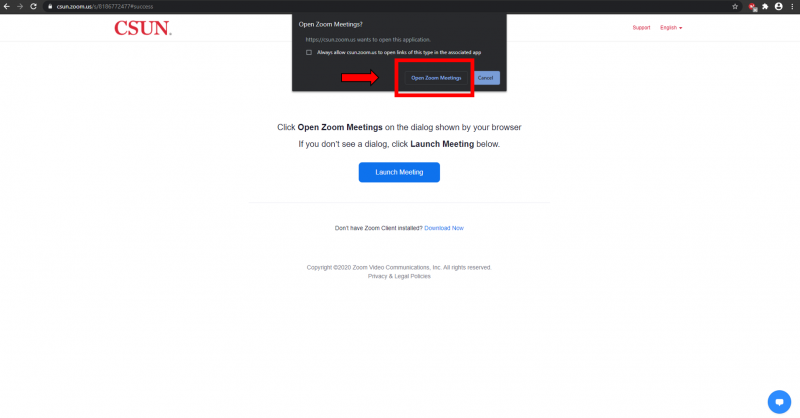

**Assign participants to breakout rooms as the host in the departmental virtual office**

1. In order to open the breakout rooms click on "Breakout Rooms".

	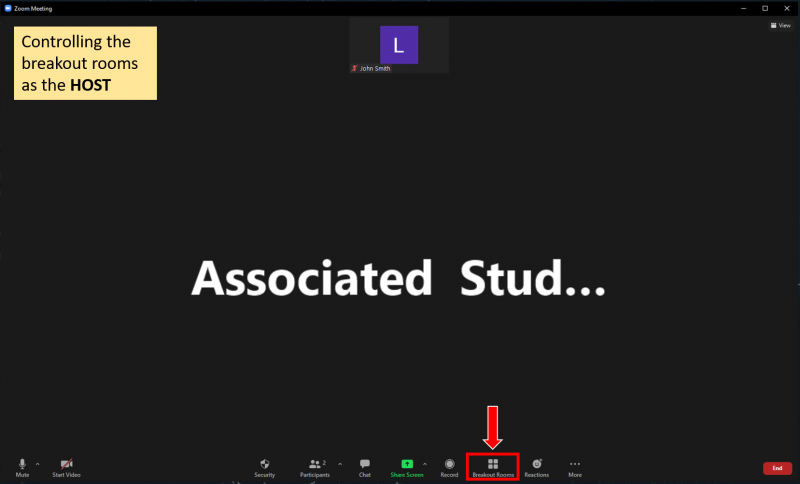

2. Click on "Open All Rooms" to open all the breakout rooms.

	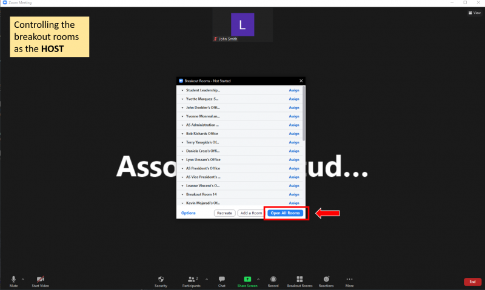

3. Click on "Options" and select "Allow participants to choose room" in order to allow the participants to assign themselves to different a breakout room at any time.

	

4. As the host, you have the authority to assign different participants to different breakout rooms. In order to assign a participant, fist locate the participant.

	

5. Once you have located the participant, click on "Assign To", and then select the breakout room that you would like to assign that participant to.

	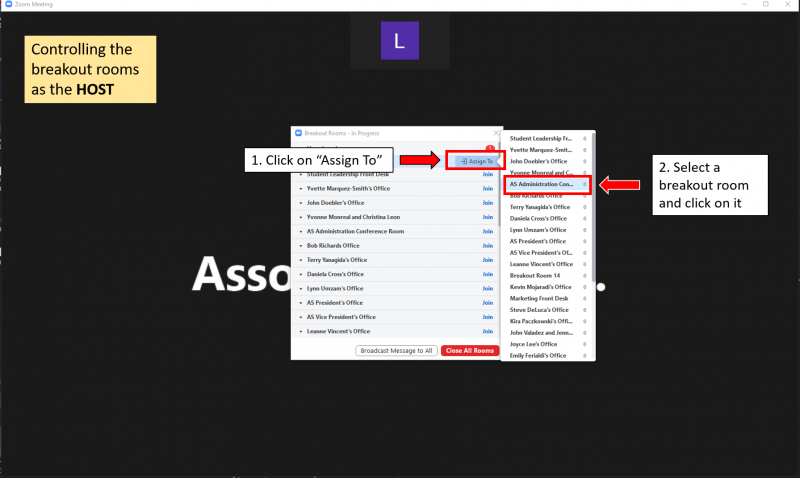

6. As you can see, "John Smith" is now in the "AS Administration Conference Room".

	

7. In order to close/open the breakout rooms pop up window, follow the directions in the screenshot below.

	

8. In order to close the breakout rooms (participants will no longer be able to join the breakout rooms) click on "Close All Rooms".
	
	
	
**Join a breakout room in the departmental virtual office as a participant**

1. To join a breakout room as a participant, click and open the "Breakout Rooms" to open the breakout rooms window.

	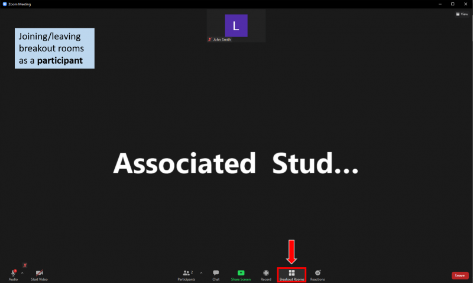

2. Select the breakout room you would like to join.

	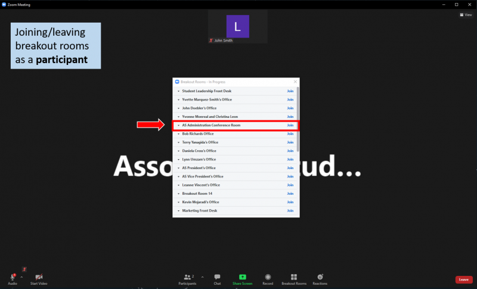

3. Click on "Join" and then and then click on the breakout room that you would like to join.

	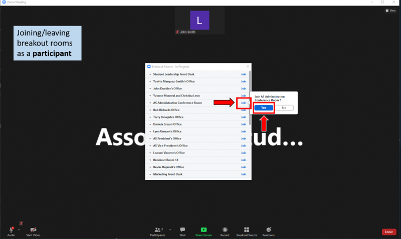

4. You will now be redirected to the selected breakout room which is "AS Administration Conference Room".

	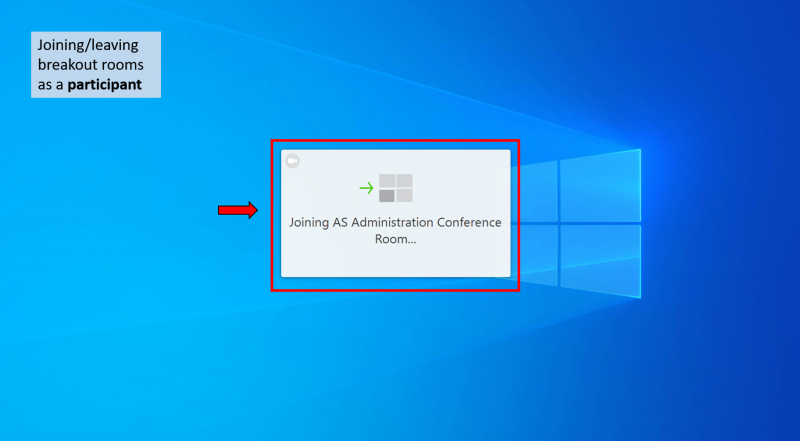

5. In order to leave a breakout room and go back to the main session, click on "Leave".

	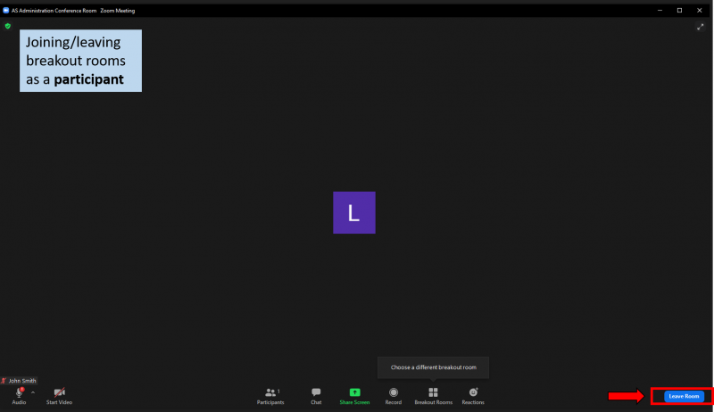

6. Click on "Leave breakout Room".

	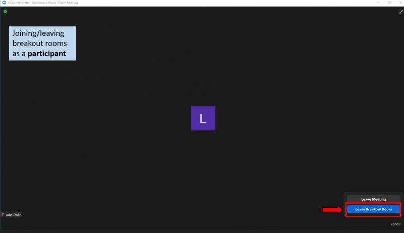

7. You will now be redirected to the main session.

	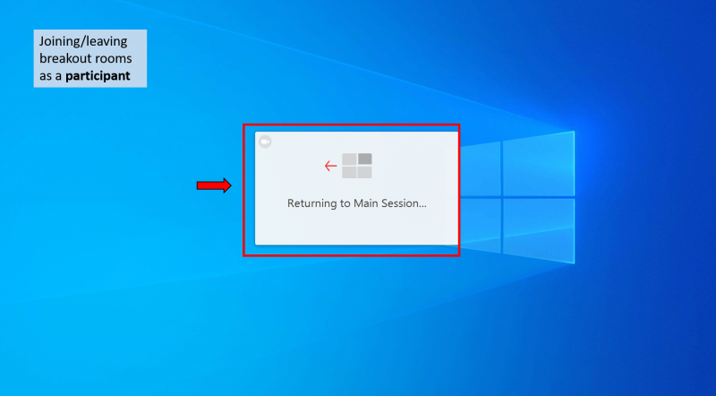

8. You are now in the main session.

	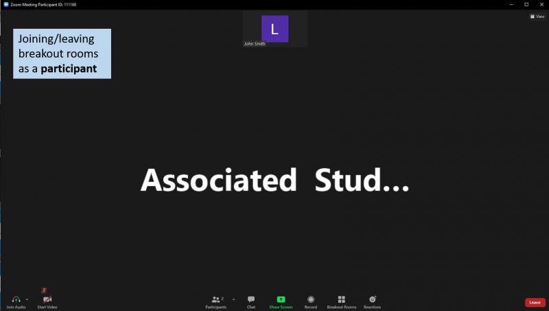

**Zoom Report**

Viewing the zoom report will allow you to see the participants that joined, duration of meeting, join time, and leave time for each participants.

1. Open a web browser and go to https://zoom.us/signin

	

	

2. Sign in with SSO

	

3. "Your Company Domain": CSUN

	

4. Enter CSUN credentials

	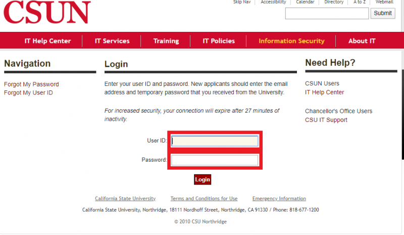
	
5. Click on "report" and then on "Usage".

	

	

6. Select the date of a meeting to run the report on and click on "Search".

	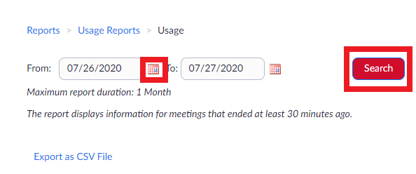

7. Click on the number in the participants row. This will allow you to see the users joined time, leave time, and duration.

	

	

Zoom on iOS 10.3.3+

-------------------------